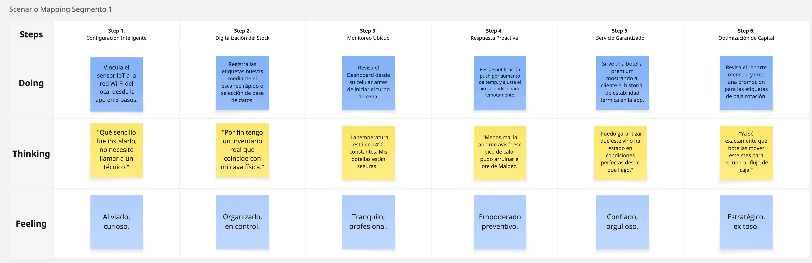
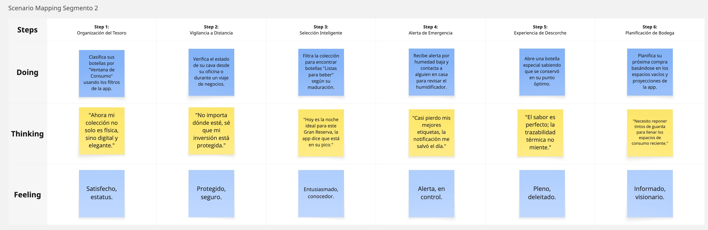
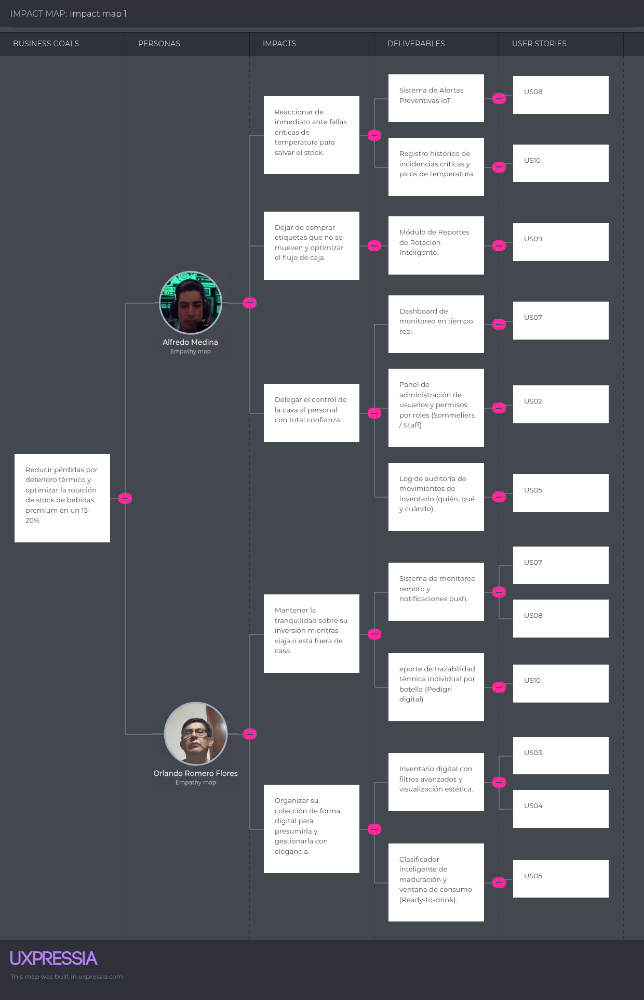

# Capítulo III: Requirements Specification

## 3.1. To-Be Scenario Mapping.

**To-Be Scenario Mapping Segmento 1:**
 

**To-Be Scenario Mapping Segmento 2:**
 

## 3.2. User Stories.

La presente sección detalla las Historias de Usuario que guiarán el desarrollo de la plataforma VineVault.

## 3.2. User Stories.

La presente sección detalla las 24 Historias de Usuario distribuidas en 7 Epics para la gestión integral de VineVault.

| Story ID | Título | Descripción | Criterios de Aceptación | Epic ID |
| :--- | :--- | :--- | :--- | :--- |
| **US01** | User Registration | **Como** nuevo usuario, **quiero** crear una cuenta **para** gestionar mi cava de forma personalizada. | 1. Validación de correo electrónico único. 2. Contraseña con al menos 8 caracteres. 3. Envío de correo de verificación. | EP01 |
| **US02** | User Login | **Como** usuario registrado, **quiero** iniciar sesión **para** acceder a mi inventario privado. | 1. Autenticación segura mediante credenciales. 2. Opción de "Recordar sesión" activa. | EP01 |
| **US03** | Profile Selection | **Como** usuario, **quiero** elegir entre perfil Comercial o Privado **para** adaptar la terminología de la app. | 1. Selección obligatoria en el primer ingreso. 2. Persistencia del tipo de perfil en la base de datos. | EP01 |
| **US04** | Manual Bottle Entry | **Como** usuario, **quiero** registrar una botella manualmente **para** actualizar mi stock digital. | 1. Campos obligatorios: Bodega, Cepa y Añada. 2. Opción de subir foto de la etiqueta. 3. Confirmación de guardado exitoso. | EP02 |
| **US05** | Label Scanning | **Como** sommelier, **quiero** escanear códigos de barras **para** agilizar el registro de nuevas cajas de vino. | 1. Acceso a la cámara del dispositivo móvil. 2. Búsqueda instantánea en base de datos global. | EP02 |
| **US06** | Uncorking Action | **Como** usuario, **quiero** marcar una botella como descorchada **para** reducir el stock automáticamente. | 1. Botón de acceso rápido en la ficha del vino. 2. Registro del motivo (Venta, Consumo, Mermas). 3. Actualización inmediata del contador. | EP02 |
| **US07** | Advanced Search | **Como** usuario, **quiero** buscar botellas por filtros **para** encontrarlas sin navegar por toda la lista. | 1. Filtros por color (Tinto, Blanco, Rosado). 2. Barra de búsqueda por nombre de bodega. | EP02 |
| **US08** | IoT Sensor Pairing | **Como** administrador, **quiero** vincular el sensor térmico **para** iniciar el monitoreo de la cava. | 1. Guía interactiva de 3 pasos para Wi-Fi. 2. Indicador visual de señal de red. 3. Notificación de emparejamiento exitoso. | EP03 |
| **US09** | Live Dashboard | **Como** usuario, **quiero** ver la temperatura en tiempo real **para** asegurar la salud del vino. | 1. Actualización de datos cada 10 minutos. 2. Indicadores de color según rango óptimo. | EP03 |
| **US10** | Thermal Thresholds | **Como** dueño, **quiero** configurar alertas térmicas **para** proteger mi inversión de picos de calor. | 1. Definición de límites personalizados (Min/Max). 2. Notificación push inmediata al celular. 3. Registro de la alerta en el log histórico. | EP03 |
| **US11** | Multi-Sensor Support | **Como** usuario con múltiples locales, **quiero** gestionar varios sensores **para** controlar distintas cavas. | 1. Selector de "Cava activa" en el menú. 2. Listado de sensores con nombres editables. | EP03 |
| **US12** | Historical Charts | **Como** analista, **quiero** ver gráficos de fluctuación **para** detectar fallas en la refrigeración. | 1. Gráfico de líneas interactivo (Temp vs Tiempo). 2. Selector de rango (Día, Semana, Mes). 3. Opción de zoom en picos específicos. | EP04 |
| **US13** | Monthly Health Report | **Como** dueño de negocio, **quiero** un reporte mensual de salud **para** auditar el estado de mi bodega. | 1. Generación automática el primer día del mes. 2. Resumen de incidentes térmicos ocurridos. | EP04 |
| **US14** | Maturity Prediction | **Como** coleccionista, **quiero** saber el pico de madurez **para** beber mis botellas en su mejor momento. | 1. Cálculo basado en tipo de uva y crianza. 2. Etiqueta visual "Listo para beber" en la app. 3. Notificación anticipada 30 días antes del pico. | EP04 |
| **US15** | Stagnant Stock Alert | **Como** administrador, **quiero** identificar vinos sin rotación **para** evitar capital inmovilizado. | 1. Identificación de botellas con 60+ días quietas. 2. Sugerencia de promoción en el dashboard. | EP04 |
| **US16** | Supplier Directory | **Como** usuario, **quiero** guardar datos de mis proveedores **para** facilitar la reposición de stock. | 1. Formulario de contacto (Nombre, Celular, Correo). 2. Vinculación de proveedor a etiquetas específicas. 3. Acceso directo a llamar/escribir desde la app. | EP05 |
| **US17** | Purchase Order Log | **Como** dueño, **quiero** registrar mis compras **para** llevar un control de gastos por etiqueta. | 1. Registro de precio de compra y fecha. 2. Posibilidad de adjuntar foto de la factura. | EP05 |
| **US18** | Reorder Suggestions | **Como** sommelier, **quiero** sugerencias de compra **para** no perder ventas por falta de stock. | 1. Cálculo basado en velocidad de consumo. 2. Generación de lista de "Pendientes por comprar". 3. Alerta de stock crítico (debajo de 3 botellas). | EP05 |
| **US19** | Tasting Notes | **Como** aficionado, **quiero** añadir mis propias notas de cata **para** recordar mis experiencias. | 1. Campo de texto para impresiones sensoriales. 2. Guardado automático al cerrar la ficha. | EP06 |
| **US20** | Rating System | **Como** usuario, **quiero** calificar mis vinos con estrellas **para** organizar mi top personal. | 1. Escala de 1 a 5 estrellas. 2. Promedio visual en el listado general. 3. Opción de filtrar por "Mejor calificados". | EP06 |
| **US21** | Share Collection | **Como** coleccionista, **quiero** compartir mi catálogo por enlace **para** mostrar mis botellas a invitados. | 1. Generación de link de "Solo lectura". 2. Opción de desactivar el link en cualquier momento. | EP06 |
| **US22** | Units Configuration | **Como** usuario, **quiero** cambiar entre Celsius y Fahrenheit **para** ver los datos en mi unidad preferida. | 1. Switch de unidad en la configuración general. 2. Actualización de todos los gráficos del sistema. 3. Guardado de preferencia por usuario. | EP07 |
| **US23** | Help Center Access | **Como** usuario nuevo, **quiero** acceder a tutoriales **para** aprender a usar los sensores IoT. | 1. Sección de FAQs con videos cortos. 2. Botón de soporte por chat directo. | EP07 |
| **US24** | Data Export (Backup) | **Como** administrador, **quiero** exportar mi inventario a Excel **para** tener un respaldo físico de mis datos. | 1. Botón de exportación masiva en Configuración. 2. Formato compatible con Excel (.xlsx) y CSV. 3. Descarga inmediata al dispositivo. | EP07 |

## 3.3. Impact Mapping.

El **Impact Mapping** constituye una técnica de planeación estratégica que nos ayuda a visualizar la relación entre las metas del negocio y la entrega de valor a los actores clave.
 

    
## 3.4. Product Backlog.

El Product Backlog constituye el inventario centralizado y priorizado de todos los requisitos, funcionalidades y mejoras necesarias para la materialización de la solución VineVault, asegurando que el equipo trabaje en lo más valioso primero.

| N | Epic / Story ID | Título | Descripción | Story Points |
| :--- | :--- | :--- | :--- | :--- |
| 1 | US01 | Account Registration | **Como** usuario nuevo, **quiero** registrar una cuenta con mis datos personales **para** acceder a la plataforma. | 1 |
| 2 | US02 | User Login | **Como** usuario registrado, **quiero** iniciar sesión de forma segura **para** visualizar mi información privada. | 1 |
| 3 | US03 | Profile Selection | **Como** usuario inicial, **quiero** elegir entre perfil "Restaurante" o "Coleccionista" **para** personalizar mi experiencia. | 1 |
| 4 | US04 | Password Recovery | **Como** usuario, **quiero** recuperar mi contraseña vía correo electrónico **para** no perder acceso a mi cuenta. | 2 |
| 5 | US05 | Manual Bottle Entry | **Como** usuario, **quiero** registrar una botella manualmente (bodega, añada, tipo) **para** actualizar mi inventario. | 3 |
| 6 | US06 | Bulk Stock Upload | **Como** dueño de negocio, **quiero** subir un archivo Excel con mi stock **para** no registrar botellas una por una. | 5 |
| 7 | US07 | Inventory Search | **Como** sommelier, **quiero** buscar etiquetas por nombre o añada **para** agilizar el servicio al cliente. | 1 |
| 8 | US08 | Advanced Filtering | **Como** coleccionista, **quiero** filtrar mis vinos por cepa, país o precio **para** organizar mis catas. | 2 |
| 9 | US09 | Register Uncorking | **Como** usuario, **quiero** marcar una botella como "descorchada" **para** reducir el stock automáticamente. | 2 |
| 10 | US10 | QR/Barcode Scanner | **Como** administrador, **quiero** escanear códigos de barras **para** registrar entradas y salidas de stock rápidamente. | 5 |
| 11 | US11 | Cellar Zone Definition | **Como** usuario, **quiero** crear zonas dentro de mi cava (Estante A, Fila B) **para** ubicar físicamente mis botellas. | 3 |
| 12 | US12 | IoT Sensor Pairing | **Como** administrador de la cava, **quiero** vincular el sensor IoT a mi red Wi-Fi **para** recibir datos ambientales. | 8 |
| 13 | US13 | Real-time Dashboard | **Como** usuario, **quiero** ver la temperatura y humedad actual en un panel visual **para** asegurar la salud del vino. | 3 |
| 14 | US14 | Multi-sensor Support | **Como** dueño de un restaurante grande, **quiero** vincular múltiples sensores **para** monitorear diferentes zonas de mi cava. | 5 |
| 15 | US15 | Historical Data Graph | **Como** coleccionista, **quiero** ver gráficos de fluctuación térmica de la última semana **para** auditar mi equipo de frío. | 5 |
| 16 | US16 | Sensor Calibration | **Como** usuario técnico, **quiero** ajustar los parámetros de calibración del sensor **para** asegurar la precisión de las lecturas. | 3 |
| 17 | US17 | Config Thermal Alerts | **Como** dueño de la cava, **quiero** establecer límites de temperatura (mín/máx) **para** recibir avisos preventivos. | 5 |
| 18 | US18 | Push Notifications | **Como** usuario móvil, **quiero** recibir alertas inmediatas en mi celular **para** actuar rápido ante un fallo climático. | 3 |
| 19 | US19 | Emergency Email Alerts | **Como** administrador, **quiero** recibir correos de emergencia cuando el sensor se desconecte **para** evitar pérdida de datos. | 3 |
| 20 | US20 | Monthly Rotation Report | **Como** dueño de negocio, **quiero** un reporte mensual de etiquetas de baja rotación **para** optimizar mi capital. | 8 |
| 21 | US21 | Thermal Traceability | **Como** coleccionista, **quiero** un certificado digital de estabilidad de mis botellas premium **para** garantizar su valor. | 5 |
| 22 | US22 | Maturity Prediction | **Como** aficionado, **quiero** alertas de "ventana óptima de consumo" **para** no dejar pasar el mejor momento de un vino. | 8 |
| 23 | US23 | Export to PDF/CSV | **Como** administrador, **quiero** exportar mi inventario actual a PDF **para** realizar auditorías físicas offline. | 3 |
| 24 | US24 | Offline Sync | **Como** usuario, **quiero** que la app guarde cambios localmente si pierdo conexión **para** sincronizarlos al recuperar internet. | 8 |