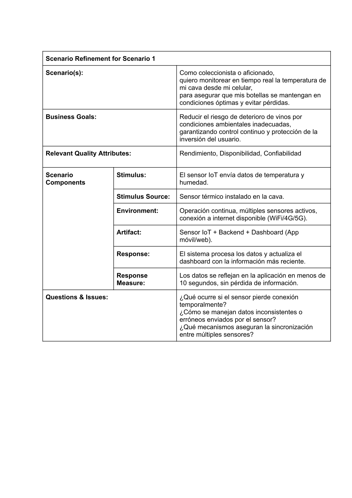
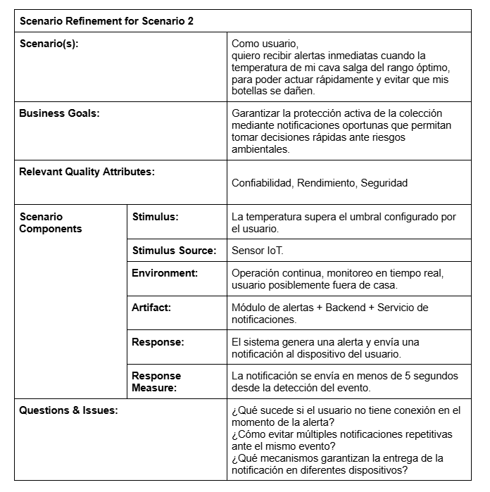
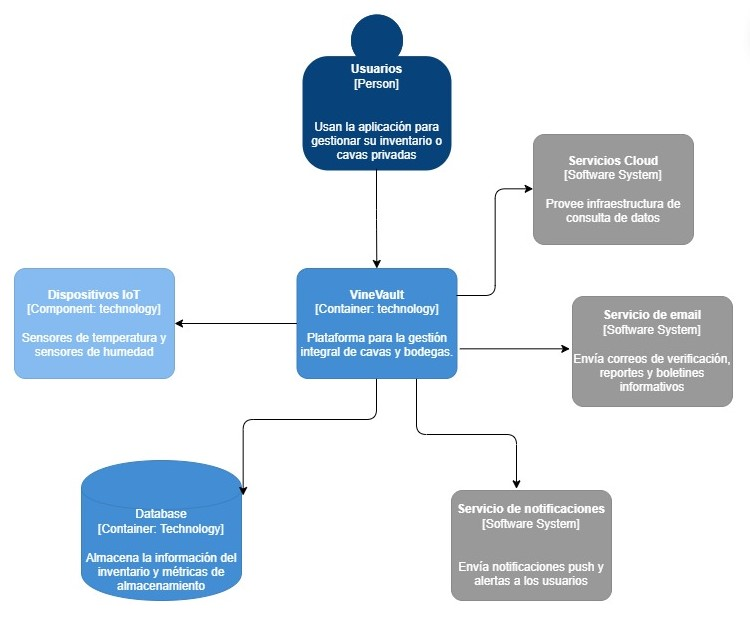
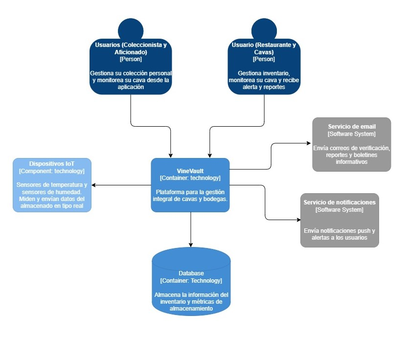
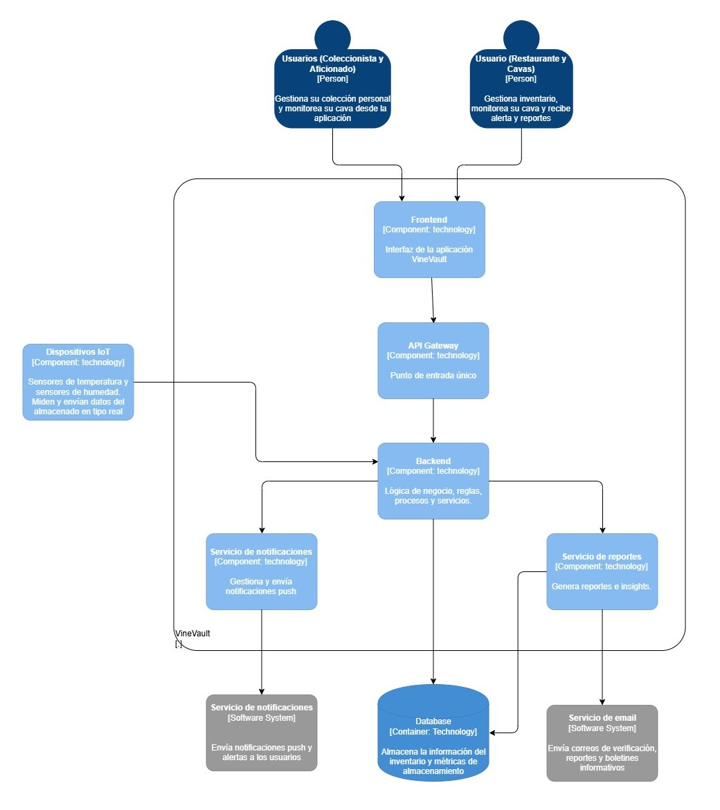
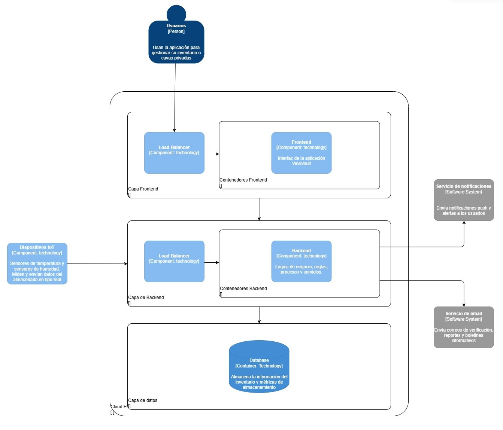

# Capítulo IV: Solution Software Design

## 4.1. Strategic-Level Attribute-Driven Design.
En esta sección se evidencia el proceso de Attribute-Driven Design para la solución. 

### 4.1.1. Design Purpose.
La razón fundamental detrás del diseño de VineVault es garantizar una gestión eficiente, segura y simplificada de cavas y bodegas, respondiendo a las necesidades reales de coleccionistas, aficionados y establecimientos que manejan bebidas premium. El propósito central es reducir la incertidumbre en el control del inventario y prevenir la pérdida de productos causada por condiciones ambientales inadecuadas, mediante una solución tecnológica que integra monitoreo en tiempo real, alertas inteligentes y digitalización del inventario.
- **Facilitar una Experiencia de Usuario Simple e Intuitiva:**
  La plataforma está diseñada para minimizar la carga operativa del usuario, evitando procesos manuales complejos. A través de funcionalidades como escaneo de botellas, registro automatizado y visualización clara del inventario, los usuarios pueden gestionar su colección de forma rápida y sin esfuerzo.

- **Optimizar el Control y la Protección de la Colección:**
  El sistema permite a los usuarios mantener visibilidad constante sobre sus botellas, así como monitorear variables críticas como temperatura y humedad. Esto reduce significativamente el riesgo de deterioro del producto y mejora la toma de decisiones sobre consumo o conservación.

- **Atender Necesidades Específicas de Cada Segmento:**
  - **Coleccionistas y Aficionados:** requieren organización sencilla, acceso rápido a su inventario y recomendaciones sobre el momento óptimo de consumo.
  - **Restaurantes y Negocios:** necesitan control preciso del stock, reducción de pérdidas y monitoreo continuo para asegurar la calidad del producto ofrecido.

- **Asegurar Monitoreo Confiable y Respuesta en Tiempo Real:**
  - Actualización de condiciones ambientales en tiempo real.
  - Envío de alertas inmediatas ante variaciones críticas.
  - Disponibilidad constante de la plataforma para consulta remota.
  - Escalabilidad para gestionar múltiples cavas o colecciones simultáneamente.

### 4.1.2. Attribute-Driven Design Inputs.
 #### 4.1.2.1. Primary Functionality (Primary User Stories).

En esta sección se especifican las User Stories primarias que resultan críticas para la arquitectura y el funcionamiento general de VineVault. Estas funcionalidades constituyen la base del sistema, ya que permiten cubrir los procesos centrales de registro de inventario, monitoreo ambiental y protección de las colecciones de vinos y destilados.

- **Registro de botellas (US04, US05):**
  Esta funcionalidad es fundamental para la digitalización de la cava. Permite ingresar botellas de forma manual o mediante escaneo, lo que obliga a la arquitectura a soportar almacenamiento estructurado de datos, procesamiento de imágenes y consultas a bases de datos externas. Impacta directamente en el modelo de datos y en la experiencia de usuario al reducir la fricción en el registro.

- **Gestión y actualización de inventario (US06, US07):**
  El sistema permite mantener actualizado el stock mediante acciones como descorchar botellas y realizar búsquedas avanzadas. Esta funcionalidad es clave para la trazabilidad del inventario, requiriendo sincronización inmediata de datos y consultas eficientes que permitan al usuario acceder rápidamente a la información.

- **Vinculación y gestión de sensores IoT (US08, US11):**
  La integración con sensores es esencial para el monitoreo ambiental. Esta funcionalidad requiere que la arquitectura soporte comunicación con dispositivos externos, manejo de múltiples sensores y configuración dinámica, impactando en la capa de integración IoT y en la escalabilidad del sistema.

- **Monitoreo ambiental en tiempo real (US09):**
  Permite visualizar variables críticas como temperatura de forma continua. Esto exige una arquitectura capaz de procesar datos en tiempo real, actualizar dashboards periódicamente y mantener consistencia entre dispositivos, lo cual impacta en el diseño de flujos de datos y almacenamiento temporal.

- **Alertas térmicas inteligentes (US10):**
  El sistema notifica al usuario ante condiciones que pueden dañar el producto. Esta funcionalidad implica una arquitectura orientada a eventos, con detección de umbrales, generación de alertas y envío de notificaciones en tiempo real, garantizando tiempos de respuesta bajos y alta confiabilidad.

- **Análisis histórico y reportes (US12, US13):**
  Permite evaluar el comportamiento ambiental y la salud de la cava a lo largo del tiempo. Esta funcionalidad requiere almacenamiento histórico de datos, generación de gráficos interactivos y procesamiento de información agregada, impactando en la capa analítica del sistema.

- **Predicción de madurez y recomendaciones (US14):**
  Esta funcionalidad agrega valor al usuario al indicar el momento óptimo de consumo de las botellas. Implica el uso de lógica de negocio basada en reglas o modelos predictivos, afectando la arquitectura en términos de procesamiento de datos y generación de insights personalizados.

#### 4.1.2.2. Quality attribute Scenarios.

En esta sección se detallan los escenarios iniciales de atributos de calidad que influyen directamente en la arquitectura de VineVault. Estos escenarios permiten definir requisitos no funcionales clave relacionados con el monitoreo en tiempo real, la confiabilidad del sistema y la protección de datos.

| ID    | Atributo      | Fuente             | Estímulo                                         | Artefacto           | Entorno                                    | Respuesta                                              | Medida                                               |
|-------|---------------|--------------------|--------------------------------------------------|----------------------|---------------------------------------------|--------------------------------------------------------|------------------------------------------------------|
| QA-01 | Rendimiento   | Sensor IoT         | Envía datos de temperatura y humedad             | Backend + Dashboard  | Operación normal con múltiples sensores activos | El sistema procesa y actualiza los datos en el dashboard | Actualización visible en menos de 10 segundos        |
| QA-02 | Confiabilidad | Sensor IoT         | Variación fuera del rango permitido              | Módulo de alertas    | Operación continua 24/7                     | El sistema genera y envía una notificación al usuario   | Notificación enviada en menos de 5 segundos          |
| QA-03 | Disponibilidad| Usuario            | Solicita acceso al dashboard                     | App web/móvil        | Acceso remoto desde cualquier ubicación     | El sistema permite visualizar inventario y estado       | Disponibilidad mayor o igual al 99 por ciento del tiempo |
| QA-04 | Escalabilidad | Múltiples usuarios | Consultas y monitoreo simultáneo de varias cavas | Backend central      | Alta concurrencia usuarios y sensores       | El sistema mantiene tiempos de respuesta estables       | Respuestas en menos de 3 segundos con múltiples usuarios |
| QA-05 | Seguridad     | Usuario            | Registro y almacenamiento de datos               | Base de datos        | Redes públicas WiFi, 4G, 5G                 | Los datos son almacenados y transmitidos de forma segura| 100 por ciento de datos protegidos mediante encriptación |

#### 4.1.2.3. Constraints.

En esta sección se presentan las restricciones del sistema, entendidas como condiciones no negociables establecidas por el cliente o por el negocio que sirven como lineamientos fundamentales para el desarrollo de la solución.

| ID     | Título                         | Descripción                                                                 | Aceptación                                                                 | EPIC  |
|--------|--------------------------------|-----------------------------------------------------------------------------|----------------------------------------------------------------------------|-------|
| CON-01 | Compatibilidad multiplataforma | La solución debe funcionar en dispositivos móviles y web para acceso remoto | Escenario 1: El usuario accede desde móvil y visualiza su inventario correctamente. Escenario 2: El usuario accede desde web y los datos se muestran sincronizados. | EP01 |
| CON-02 | Integración con sensores IoT   | El sistema debe conectarse con sensores para monitoreo ambiental            | Escenario 1: El sensor envía datos y el sistema los recibe correctamente. Escenario 2: El usuario visualiza los datos y estos se reflejan en el dashboard. | EP03 |
| CON-03 | Monitoreo en tiempo real       | El sistema debe procesar datos ambientales en tiempo casi real              | Escenario 1: El sensor envía datos y la actualización se realiza en menos de 10 segundos. Escenario 2: Existen múltiples sensores activos y el sistema mantiene la actualización continua. | EP03 |
| CON-04 | Alertas inmediatas             | El sistema debe notificar cambios críticos de temperatura/humedad           | Escenario 1: Se supera el umbral y se envía una notificación. Escenario 2: El usuario recibe la alerta y puede actuar rápidamente. | EP03 |
| CON-05 | Almacenamiento histórico       | El sistema debe guardar datos históricos para análisis                      | Escenario 1: El sistema registra datos continuamente y se almacenan correctamente. Escenario 2: El usuario consulta el historial y visualiza gráficos sin errores. | EP04 |
| CON-06 | Arquitectura escalable         | La solución debe soportar múltiples usuarios y sensores simultáneamente     | Escenario 1: Varios usuarios acceden y el sistema responde sin caídas. Escenario 2: Existen múltiples sensores activos y no se degrada el rendimiento. | EP03 |
| CON-07 | Seguridad de datos             | La información debe almacenarse y transmitirse de forma segura              | Escenario 1: El usuario registra datos y estos se almacenan encriptados. Escenario 2: El usuario accede desde una red pública y la información se mantiene segura. | EP01 |
| CON-08 | Simplicidad de uso             | La aplicación debe ser fácil de usar y evitar procesos manuales complejos   | Escenario 1: El usuario registra una botella y el proceso es rápido. Escenario 2: El usuario navega en la aplicación y la interfaz es intuitiva sin fricción. | EP02 |

#### 4.1.2.3. Constraints.

En esta sección se presentan las restricciones del sistema, entendidas como condiciones no negociables establecidas por el cliente o por el negocio que sirven como lineamientos fundamentales para el desarrollo de la solución.

| ID     | Título                         | Descripción                                                                 | Aceptación                                                                 | EPIC  |
|--------|--------------------------------|-----------------------------------------------------------------------------|----------------------------------------------------------------------------|-------|
| CON-01 | Compatibilidad multiplataforma | La solución debe funcionar en dispositivos móviles y web para acceso remoto | Escenario 1: El usuario accede desde móvil y visualiza su inventario correctamente. Escenario 2: El usuario accede desde web y los datos se muestran sincronizados. | EP01 |
| CON-02 | Integración con sensores IoT   | El sistema debe conectarse con sensores para monitoreo ambiental            | Escenario 1: El sensor envía datos y el sistema los recibe correctamente. Escenario 2: El usuario visualiza los datos y estos se reflejan en el dashboard. | EP03 |
| CON-03 | Monitoreo en tiempo real       | El sistema debe procesar datos ambientales en tiempo casi real              | Escenario 1: El sensor envía datos y la actualización se realiza en menos de 10 segundos. Escenario 2: Existen múltiples sensores activos y el sistema mantiene la actualización continua. | EP03 |
| CON-04 | Alertas inmediatas             | El sistema debe notificar cambios críticos de temperatura/humedad           | Escenario 1: Se supera el umbral y se envía una notificación. Escenario 2: El usuario recibe la alerta y puede actuar rápidamente. | EP03 |
| CON-05 | Almacenamiento histórico       | El sistema debe guardar datos históricos para análisis                      | Escenario 1: El sistema registra datos continuamente y se almacenan correctamente. Escenario 2: El usuario consulta el historial y visualiza gráficos sin errores. | EP04 |
| CON-06 | Arquitectura escalable         | La solución debe soportar múltiples usuarios y sensores simultáneamente     | Escenario 1: Varios usuarios acceden y el sistema responde sin caídas. Escenario 2: Existen múltiples sensores activos y no se degrada el rendimiento. | EP03 |
| CON-07 | Seguridad de datos             | La información debe almacenarse y transmitirse de forma segura              | Escenario 1: El usuario registra datos y estos se almacenan encriptados. Escenario 2: El usuario accede desde una red pública y la información se mantiene segura. | EP01 |
| CON-08 | Simplicidad de uso             | La aplicación debe ser fácil de usar y evitar procesos manuales complejos   | Escenario 1: El usuario registra una botella y el proceso es rápido. Escenario 2: El usuario navega en la aplicación y la interfaz es intuitiva sin fricción. | EP02 |
### 4.1.3. Architectural Drivers Backlog.

| Driver ID | Título          | Descripción                                                                                                                                 | Importancia | Complejidad Técnica |
|-----------|----------------|---------------------------------------------------------------------------------------------------------------------------------------------|-------------|---------------------|
| DR-01     | Rendimiento    | Capacidad del sistema para procesar datos de sensores IoT y reflejarlos en el dashboard en menos de 10 segundos, así como generar alertas inmediatas ante variaciones críticas, garantizando monitoreo en tiempo casi real. | Alta        | Alta                |
| DR-02     | Disponibilidad | Capacidad del sistema para mantenerse operativo de forma continua 24/7, permitiendo a los usuarios acceder al estado de su cava y monitorear condiciones ambientales desde cualquier ubicación sin interrupciones. | Alta        | Media               |
| DR-03     | Seguridad      | Implementación de mecanismos de protección de datos, incluyendo almacenamiento seguro, comunicación encriptada y protección ante accesos no autorizados, garantizando la confidencialidad de la información del usuario y su colección. | Alta        | Media               |
| DR-04     | Usabilidad     | Capacidad del sistema para ofrecer una experiencia simple e intuitiva, permitiendo registrar botellas, consultar inventario y visualizar datos sin fricción, reduciendo la dependencia de procesos manuales. | Alta        | Media               |
| DR-05     | Escalabilidad  | Habilidad del sistema para soportar múltiples usuarios y sensores IoT simultáneamente, manteniendo tiempos de respuesta estables y sin degradación del servicio en escenarios de crecimiento. | Alta        | Alta                |
| DR-06     | Confiabilidad  | Garantía de funcionamiento consistente del sistema, asegurando la correcta recepción de datos de sensores y el envío de alertas sin pérdida de información, incluso en operación continua. | Media       | Alta                |
| DR-07     | Interoperabilidad | Capacidad del sistema para integrarse con dispositivos IoT, sensores ambientales y servicios externos, utilizando protocolos estándar y APIs para asegurar comunicación eficiente. | Media       | Media               |
| DR-08     | Modificabilidad | Facilidad para extender el sistema, incorporar nuevos sensores, mejorar funcionalidades y adaptar reglas de negocio sin afectar componentes existentes ni generar deuda técnica significativa. | Media       | Media               |

### 4.1.4. Architectural Design Decisions.

| Driver ID | Título          | Descripción                                                                                                                                 | Importancia | Complejidad Técnica |
|-----------|----------------|---------------------------------------------------------------------------------------------------------------------------------------------|-------------|---------------------|
| DR-01     | Rendimiento    | Capacidad del sistema para procesar datos de sensores IoT y reflejarlos en el dashboard en menos de 10 segundos, así como generar alertas inmediatas ante variaciones críticas, garantizando monitoreo en tiempo casi real. | Alta        | Alta                |
| DR-02     | Disponibilidad | Capacidad del sistema para mantenerse operativo de forma continua 24/7, permitiendo a los usuarios acceder al estado de su cava y monitorear condiciones ambientales desde cualquier ubicación sin interrupciones. | Alta        | Media               |
| DR-03     | Seguridad      | Implementación de mecanismos de protección de datos, incluyendo almacenamiento seguro, comunicación encriptada y protección ante accesos no autorizados, garantizando la confidencialidad de la información del usuario y su colección. | Alta        | Media               |
| DR-04     | Usabilidad     | Capacidad del sistema para ofrecer una experiencia simple e intuitiva, permitiendo registrar botellas, consultar inventario y visualizar datos sin fricción, reduciendo la dependencia de procesos manuales. | Alta        | Media               |
| DR-05     | Escalabilidad  | Habilidad del sistema para soportar múltiples usuarios y sensores IoT simultáneamente, manteniendo tiempos de respuesta estables y sin degradación del servicio en escenarios de crecimiento. | Alta        | Alta                |
| DR-06     | Confiabilidad  | Garantía de funcionamiento consistente del sistema, asegurando la correcta recepción de datos de sensores y el envío de alertas sin pérdida de información, incluso en operación continua. | Media       | Alta                |
| DR-07     | Interoperabilidad | Capacidad del sistema para integrarse con dispositivos IoT, sensores ambientales y servicios externos, utilizando protocolos estándar y APIs para asegurar comunicación eficiente. | Media       | Media               |
| DR-08     | Modificabilidad | Facilidad para extender el sistema, incorporar nuevos sensores, mejorar funcionalidades y adaptar reglas de negocio sin afectar componentes existentes ni generar deuda técnica significativa. | Media       | Media               |

La arquitectura de Monolito Modular basada en Domain-Driven Design (DDD) se presenta como la alternativa más adecuada para el desarrollo de VineVault. Esta decisión se fundamenta en los siguientes aspectos:

En primer lugar, permite cumplir de manera efectiva con los drivers arquitectónicos definidos, especialmente en lo relacionado con el monitoreo en tiempo casi real de condiciones ambientales, la seguridad de los datos de los usuarios y la confiabilidad en la gestión del inventario de botellas.

Asimismo, reduce la complejidad operativa del sistema, lo cual resulta clave considerando que el proyecto está orientado a un entorno con recursos de desarrollo limitados. Una arquitectura monolítica modular facilita el desarrollo, despliegue y mantenimiento sin introducir sobrecarga innecesaria.

Por otro lado, esta arquitectura favorece la aplicación de Domain-Driven Design, permitiendo organizar el sistema en dominios claramente definidos como Inventario, Monitoreo IoT, Alertas y Análisis. Esto contribuye a una mejor estructuración del código y a una mayor coherencia con las necesidades del negocio.

Finalmente, evita la complejidad adicional que implicaría una arquitectura de microservicios, la cual, si bien es escalable, introduciría desafíos innecesarios en términos de comunicación entre servicios, despliegue distribuido y mantenimiento. Dado el alcance actual de VineVault, una solución monolítica modular resulta más eficiente, manejable y alineada con los requerimientos del sistema.

### 4.1.5. Quality Attribute Scenario Refinements.

## 4.2. Strategic-Level Domain-Driven Design.

Link del miro: https://miro.com/app/board/uXjVHXRgC6E=/?share_link_id=317409539991

### 4.2.1. EventStorming.

*Step 1: Unstructured Exploration*

Primero empezamos  con una lluvia de ideas de los eventos del dominio relacionados con el dominio empresarial que se está explorando. Un evento de dominio es algo interesante que ha sucedido en el negocio. Es importante formular eventos de dominio en tiempo pasado; están describiendo cosas que ya han sucedido.

*Step 2: Timelines*

Ahora revisamos  los eventos de dominio generados y los organizan en el orden en que ocurren en el dominio empresarial. Los eventos deben comenzar con el happy path: el flujo que describe un escenario empresarial exitoso.

*Step 3: Paint Points*

Ahora veremos que todos los eventos organizados en una línea de tiempo, use esta vista amplia para identificar
puntos en el proceso que requieren atención. Estos pueden ser cuellos de botella, pasos manuales que
requieren automatización, documentación faltante o conocimiento de dominio faltante.

*Step 4: Pivotal Points*

En esta Seccion buscamos eventos comerciales importantes que indiquen un cambio en el contexto o la fase. Estos se denominan eventos fundamentales y están marcados con una barra vertical que divide los eventos antes y después del evento fundamental. 

*Step 5: Commands*

Ahora en  los comandos que describe qué desencadenó el evento o el flujo de eventos. Los comandos describen las operaciones del sistema y, contrariamente a los eventos de dominio, se formulan en imperativo.

*Step 6: Policies*

Seguimos con agregar  al modelo, pero no tienen un actor específico asociado con ellos. Durante este paso, busca automation policies que puedan ejecutar esos comandos. Una automation policy un escenario en el que un evento desencadena la ejecución de un comando. En otras palabras, un comando se ejecuta automáticamente cuando ocurre un evento de dominio específico

*Step7: ReadModels*

continuamos con Un modelo de lectura es la vista de datos dentro del dominio que el actor usa para tomar la decisión de ejecutar un comando. Puede ser una de las pantallas del sistema, un informe, una notificación, etc..

*Step 8: External Systems*

Seguimos con los servicio externos este paso consiste en aumentar el modelo con sistemas externos. Un sistema externo se define como cualquier sistema que no forma parte del dominio que se está explorando. Puede ejecutar comandos (entrada) o puede ser notificado sobre eventos (salida).

*Step 9: Aggregates*

Una vez que todos los eventos y comandos están representados, los participantes pueden comenzar a pensar en organizar conceptos relacionados en agregados. Un agregado recibe comandos y produce eventos.

### 4.2.2. Candidate Context Discovery.

*Step 10: Bounded Contexts*

El último paso de una sesión de tormenta de eventos es buscar agregados que estén relacionados entre sí, ya sea porque representan una funcionalidad estrechamente relacionada o porque están acoplados a través de políticas. Los grupos de agregados forman candidatos naturales para los límites de los contextos delimitados.

Durante la sesión, el equipo ejecutó las siguientes actividades:

1. **Descubrimiento de Domain Events (post-its naranjas):** Se identificaron los eventos más relevantes del negocio, tales como `User Registered`, `Wine Created`, `Sensor Activated`, `Alert Threshold Exceeded`, `Monthly Report Generated`, entre otros. Estos se dispusieron en orden cronológico sobre una línea de tiempo horizontal.

2. **Identificación de Actores y Sistemas Externos (post-its azules y rosas):** Se agregaron los usuarios (`Collector`, `Admin`), los sistemas externos (`Payment Gateway`, `Email Service`) y las políticas de negocio que disparan acciones automáticas.

3. **Comandos y Agregados (post-its amarillos y verdes):** Para los flujos más críticos, se modelaron los comandos que desencadenan los eventos y los agregados responsables de mantener la consistencia.

4. **Validación de la narrativa:** Se recorrió la línea de tiempo completa verificando que cada evento tuviera un origen lógico (comando o política) y un consumidor claro, eliminando ambigüedades en el lenguaje.

#### Técnicas aplicadas

Se aplicaron las siguientes técnicas durante la sesión:

#### a) Start-with-value

Se identificaron las partes del dominio que aportan mayor valor diferencial al negocio:

- **Inventory Intelligence:** Es el *core domain*, ya que la recomendación predictiva y el análisis de consumo son la propuesta de valor principal frente a competidores.
- **Environmental Monitoring:** Es un *supporting domain* crítico, ya que la monitorización en tiempo real justifica la suscripción Premium.

#### b) Start-with-simple

En lugar de intentar diseñar todos los contextos a la vez, se descompuso la línea de tiempo del EventStorm en pasos secuenciales simples:

1. El usuario se registra → **IAM**
2. El usuario crea su cava y añade vinos → **Wine Catalog**
3. El sistema conecta sensores y monitorea → **Environmental Monitoring**
4. Si hay desviaciones, se notifica → **Notification**
5. El usuario paga por el servicio → **Subscription / Billing**
6. El sistema analiza patrones y recomienda → **Inventory Intelligence**

#### c) Look-for-pivotal-events

Se buscaron eventos clave que indicaran cambios de estado y, por tanto, cambios de modelo:

- **`User Registered`** → separa el mundo externo (registro) del dominio interno (gestión de la cava).
- **`Sensor Activated`** → marca el paso de la gestión manual de inventario a la monitorización automatizada.
- **`Alert Threshold Exceeded`** → evento pivote que conecta el dominio de monitorización con el de notificaciones.
- **`Subscription Upgraded`** → delimita el contexto de facturación del contexto de catálogo de vinos.

#### Bounded Contexts identificados

Como resultado de la sesión, se definieron los siguientes **Bounded Contexts candidatos**:

| Bounded Context | Tipo (Core/Generic/Supporting) | Descripción |
|---|---|---|
| **IAM** | Generic | Gestión de identidad, autenticación, autorización y perfiles de usuario. |
| **Wine Catalog** | Core domain | Administración del inventario físico: añadir, clasificar, consumir y valorizar los vinos de la cava. |
| **Environmental Monitoring** | Supporting | Gestión de dispositivos IoT, lecturas de sensores y evaluación de condiciones ambientales. |
| **Notification** | Generic | Emisión de alertas, recordatorios y reportes a través de múltiples canales (email, push). |
| **Subscription & Billing** | Supporting | Gestión de planes de suscripción, pagos recurrentes y control de acceso a funcionalidades Premium. |
| **Inventory Intelligence** | Core domain | Motor analítico que genera reportes de consumo, predicciones de maduración y recomendaciones de compra. |

## Relaciones entre contextos

Se identificaron las siguientes relaciones de colaboración:

- **IAM → Wine Catalog:** IAM publica `User Registered` / `User Authenticated` que el catálogo consume para crear perfiles de coleccionista.
- **Wine Catalog → Inventory Intelligence:** El catálogo alimenta datos de inventario al motor analítico.
- **Environmental Monitoring → Notification:** Cuando se excede un umbral, se emite un `Alert Triggered` que el contexto de notificaciones procesa.
- **Subscription → Wine Catalog / Environmental Monitoring:** El nivel de suscripción determina qué funcionalidades (cantidad de vinos, número de sensores) están disponibles.

### 4.2.3. Domain Message Flows Modeling.

A partir del análisis del modelo de dominio, se han identificado y modelado flujos de mensajes críticos que describen la interacción entre los diferentes actores, sistemas externos y los Bounded Contexts. Estos escenarios validan cómo la información fluye para cumplir los objetivos de negocio:

**Scenario: User Registration and Access Activation:**

1. El flujo inicia cuando un User interactúa con el Website para registrarse enviando los datos correspondientes (email y password).

2. El comando Register User se envía al contexto IAM.

3. IAM emite el evento de dominio User registered.

4. El sistema valida la cuenta y se emite el comando Send Verification Email, que es manejado por un Email Service (sistema externo) para enviar el correo al usuario.

5. Una vez que el usuario verifica su correo a través de la interfaz web (Verify User Email), IAM emite el evento User Email verified.

6. Este evento es crucial, ya que dispara la creación inicial de la cava en el contexto WINE INVENTORY (Create initial cava), almacenando la información de manera persistente.

**Scenario: Bottle Registration & connect to IoT:**

1. El User ingresa una nueva botella mediante el Website ejecutando el comando Register new Bottle.

2. El comando es procesado por el contexto WINE INVENTORY.

3. Se genera el evento Bottle registered.

4. El inventario sincroniza esta nueva entrada con el estado del sistema IoT (SYNCHRONIZED IoT), vinculando el ID de la botella y de la cava.

**Scenario: Real-Time Environmental Alert & Notification:**

1. El sensor IoT (Sensor ESP32) envía datos telemétricos (Push Telemetry Data) continuamente al contexto Environmental Monitoring.

2. Este contexto ejecuta una lógica interna para validar los rangos ambientales (Validate Environmental Ranges).

3. Si se detecta una anomalía, se emite el evento Critical Temperature Alert Detected.

4. Este evento es consumido por el contexto Notification, el cual procesará y enviará la alerta al usuario (como se definió en el Context Map a través de eventos publicados).

**Scenario: Bottle Removal & Consumption Tracking:**

1. El usuario (Home User / Sommelier) retira una botella ejecutando el comando Remove Bottle from Inventory sobre el contexto WINE INVENTORY.

3. Se emite el evento de dominio Bottle Consumption Registered.

4. Este evento desencadena un Bottle Consumption Report que es procesado por el contexto de análisis, Inventory Intelligence.

5. Si el stock remanente es bajo, el contexto de análisis emite el comando Send Low Stock Warning hacia el contexto Notification.

6. Finalmente, Notification envía la alerta (Low Stock Warning Sent) al usuario.

### 4.2.4. Bounded Context Canvases.

**Explicacion:** Identity & Access Management (IAM) - Generic Subdomain: Este contexto se encarga de la gestión del ciclo de vida del usuario, la autenticación y la autorización basada en roles. Es un subdominio genérico porque, aunque es vital para la seguridad y el multitenancy, no representa la ventaja competitiva principal del sistema.

**Explicacion:** Wine  Inventory - Core Domain: Representa el corazón del sistema. Es responsable de mantener la integridad física y lógica del inventario de botellas. Aquí reside el Lenguaje Ubicuo crítico como "Bottle Instance", "Wine Profile" y las reglas de trazabilidad obligatoria. Al ser el núcleo operativo, requiere la mayor inversión de esfuerzo arquitectónico.

**Explicacion:** Environmental Monitoring - Supporting Domain: Su propósito es capturar, validar y persistir los flujos de datos (telemetría) provenientes de los sensores IoT físicos (temperatura y humedad). Maneja conceptos como "Threshold", "Environmental Drift" y "Heartbeat". Da soporte al Core Domain al proveer los datos crudos del entorno de la cava.

**Explicacion:** Inventory Intelligence - Core Domain: Este es el motor analítico diferencial de VineVault. Transforma los datos históricos de inventario y la telemetría en insights accionables, como predicciones de maduración y recomendaciones de consumo.

**Explicacion:** Centraliza la lógica de despacho de mensajes (alertas térmicas, reportes mensuales) hacia los usuarios finales a través de múltiples canales (Email, Push). 

### 4.2.5. Context Mapping.

Una vez identificados los seis Bounded Contexts candidatos durante la sesión de *Candidate Context Discovery*, el equipo realizó un ejercicio de **Context Mapping** con el objetivo de definir las relaciones estructurales entre ellos. Este proceso permitió visualizar cómo los contextos colaboran, qué dependencias existen y qué patrones de integración de Domain-Driven Design resultan más apropiados para mantener la autonomía de cada modelo sin sacrificar la cohesión del sistema.

Para cada relación potencial entre Bounded Contexts, el equipo discutió las siguientes preguntas de diseño:

| Pregunta de diseño | Contexto aplicado | Conclusión del equipo |
|---|---|---|
| *¿Qué pasaría si movemos este capability a otro bounded context?* | ¿Mover la gestión de umbrales de alerta de **Environmental Monitoring** a **Notification**? | Rechazado. El umbral es lógica de dominio del sensor, no del canal de notificación. |
| *¿Qué pasaría si descomponemos este capability y movemos uno de los sub-capabilities a otro bounded context?* | ¿Separar la clasificación de vinos (uva, región, año) del **Wine Catalog** hacia **Inventory Intelligence**? | Rechazado. La clasificación es parte del lenguaje del coleccionista; el catálogo debe mantenerla. |
| *¿Qué pasaría si partimos el bounded context en múltiples bounded contexts?* | ¿Dividir **Subscription & Billing** en dos: uno para planes y otro para pagos? | Rechazado. Ambos comparten el mismo lenguaje de "suscripción activa" y el ciclo de vida está acoplado. |
| *¿Qué pasaría si tomamos este capability de estos 3 contexts y lo usamos para formar un nuevo context?* | ¿Extraer la validación de permisos de IAM, Wine Catalog y Environmental Monitoring hacia un nuevo **Authorization Context**? | Rechazado. Sobre-diseño. IAM ya cubre identidad; duplicaría esfuerzos. |
| *¿Qué pasaría si duplicamos una funcionalidad para romper la dependencia?* | ¿Duplicar el cálculo de "vino disponible" en **Wine Catalog** y **Inventory Intelligence**? | Parcialmente aceptado. Intelligence mantiene su propia vista de lectura (CQRS) para reportes, pero la fuente de verdad permanece en Wine Catalog. |
| *¿Qué pasaría si creamos un shared service para reducir la duplicación entre múltiples bounded contexts?* | ¿Crear un servicio compartido de plantillas de email para **Notification** y **Subscription & Billing**? | Rechazado. Notification es genérico y puede absorber la responsabilidad sin acoplarse a facturación. |
| *¿Qué pasaría si aislamos los core capabilities y movemos los otros a un context aparte?* | ¿Mover el historial de lecturas de sensores de **Environmental Monitoring** a un contexto de Data Lake? | Rechazado para MVP. Aceptado como evolución futura si el volumen de datos IoT crece. |

##### Diagrama de Context Mapping 

##### 1. Wine Catalog → Inventory Intelligence: **Conformist**
- **Upstream:** Wine Catalog
- **Downstream:** Inventory Intelligence
- **Decisión:** Intelligence se conforma al modelo Wine del catálogo
- **Rationale:** Duplicar el modelo generaría inconsistencias en reportes analíticos

##### 2. IAM → Wine Catalog: **Customer/Supplier**
- **Upstream:** IAM
- **Downstream:** Wine Catalog
- **Decisión:** IAM es supplier de autenticación y roles
- **Rationale:** El catálogo no debe gestionar su propia autenticación

##### 3. Subscription & Billing → Wine Catalog: **Customer/Supplier**
- **Upstream:** Subscription & Billing
- **Downstream:** Wine Catalog
- **Decisión:** Subscription define límites de capacidad
- **Rationale:** La definición de "qué incluye cada plan" es regla de negocio de marketing

##### 4. IAM → Inventory Intelligence: **Customer/Supplier**
- **Upstream:** IAM
- **Downstream:** Intelligence
- **Decisión:** IAM provee autenticación centralizada
- **Rationale:** Los reportes contienen datos sensibles; la autorización debe ser auditada

##### 5. Environmental Monitoring → Inventory Intelligence: **Anti-Corruption Layer (ACL)**
- **Upstream:** Environmental Monitoring
- **Downstream:** Intelligence
- **Decisión:** ACL traduce eventos técnicos de IoT a modelo de dominio
- **Rationale:** Protege el modelo analítico de la volatilidad del hardware IoT

##### 6. Inventory Intelligence → Notification: **Published Events** (asíncrono)
- **Patrón:** Eventos publicados
- **Rationale:** Reportes batch no deben bloquearse por retrasos en Notification

##### 7. Environmental Monitoring → Notification: **Published Events** (asíncrono)
- **Patrón:** Eventos publicados
- **Rationale:** IoT no debe gestionar plantillas de email ni reintentos

##### 8. Subscription & Billing → Notification: **Conformist**
- **Upstream:** Subscription & Billing
- **Downstream:** Notification
- **Rationale:** El email de facturación es la fuente de verdad del contacto

##### 9. IAM → Notification: **Customer/Supplier**
- **Upstream:** IAM
- **Downstream:** Notification
- **Rationale:** Notification necesita roles para filtrar alertas

##### 10. IAM ↔ Subscription & Billing: **Shared Kernel**
- **Patrón:** Compartido acotado a User Identity & Permissions
- **Rationale:** Ninguno puede imponer su ritmo al otro; cambios requieren aprobación conjunta

##### 11. Subscription & Billing → IAM: **Customer/Supplier**
- **Upstream:** Subscription & Billing
- **Downstream:** IAM
- **Rationale:** Subscription define qué permisos son "premium"

##### Resumen de Patrones

| Relación | Patrón |
|----------|--------|
| Wine Catalog → Intelligence | Conformist |
| IAM → Wine Catalog | Customer/Supplier |
| Subscription → Wine Catalog | Customer/Supplier |
| IAM → Intelligence | Customer/Supplier |
| Environmental Monitoring → Intelligence | ACL |
| Intelligence → Notification | Published Events |
| Environmental Monitoring → Notification | Published Events |
| Subscription → Notification | Conformist |
| IAM → Notification | Customer/Supplier |
| IAM ↔ Subscription | Shared Kernel |
| Subscription → IAM | Customer/Supplier |

## 4.3. Software Architecture.

### 4.3.1. Software Architecture System Landscape Diagram.

<td> </td>

El System Landscape Diagram proporciona una vista de alto nivel del ecosistema tecnológico en el que opera VineVault, mostrando la interacción del sistema central con los usuarios y los sistemas de software externos.

**Actores (Persons):**

- Usuarios (Coleccionista y Aficionado): Utilizan la aplicación principal para gestionar su inventario o cavas privadas, monitorizando su colección de forma remota.

**Sistemas Internos:**

- VineVault [Container: technology]: Representa la plataforma principal para la gestión integral de cavas y bodegas. Es el núcleo de la solución que orquesta la lógica de negocio.

- Database [Container: Technology]: El repositorio central de datos. Almacena de manera persistente la información del inventario (botellas, catálogos) y las métricas de almacenamiento generadas por los sensores.

**Sistemas Externos y Dispositivos:**

- Dispositivos IoT [Component: technology]: Hardware físico desplegado en las cavas. Son los sensores de temperatura y humedad que envían datos en tiempo real hacia VineVault.

- Servicios Cloud [Software System]: Proveedor de infraestructura en la nube que da soporte a las consultas de datos (alojamiento, bases de datos gestionadas, etc.).

- Servicio de email [Software System]: Proveedor externo encargado de enviar correos electrónicos transaccionales (verificación de cuentas) y reportes o boletines informativos a los usuarios.

- Servicio de notificaciones [Software System]: Sistema externo que gestiona el envío de notificaciones push (alertas críticas en dispositivos móviles) a los usuarios.

### 4.3.2. Software Architecture Context Level Diagrams.

<td> </td>

**Este nivel describe cómo VineVault interactúa con su entorno a un nivel macro.**

- Actores Principales: El sistema atiende a dos perfiles clave. El Coleccionista/Aficionado, que gestiona su colección personal desde la aplicación , y el Usuario de Restaurante/Negocio, que requiere un control riguroso del inventario y alertas tempranas.  
 

- Sistema Central (VineVault): La plataforma integral de gestión de cavas y bodegas.  
 

- Sistemas Externos: VineVault se integra con Dispositivos IoT (hardware externo, como microcontroladores ESP32, que envían métricas ambientales) , un Servicio de Email (para verificación de cuentas y envío de reportes) , y un Servicio de Notificaciones Push para alertas críticas en tiempo real.

### 4.3.3. Software Architecture Container Level Diagrams.

<td> </td>

**En este nivel hacemos un "zoom in" al sistema VineVault para exponer sus piezas de software ejecutables y la tecnología elegida para su implementación.**

- Frontend Web Application (Vue 3): Aplicación Single-Page Application (SPA) construida con Vue 3 que proporciona la interfaz gráfica interactiva, rápida e intuitiva para los usuarios. Se encarga de la visualización del dashboard, gestión del inventario y gráficos históricos.
 

- API Gateway: Punto de entrada único para las peticiones del frontend y de los sensores IoT. Enruta las solicitudes, maneja la limitación de tasa (rate limiting) y centraliza la autenticación antes de pasar al backend.
 

- Backend Core API (C# / .NET): El contenedor principal del sistema. Desarrollado en C#, este monolito modular orquesta toda la lógica de negocio descrita en los Bounded Contexts. Implementa la validación de inventario, el motor analítico de inteligencia y el procesamiento de las reglas de alertas ambientales.
 

- Database Container: Motor de base de datos relacional (y base de datos de series temporales para telemetría) que almacena de forma segura la información de inventario, perfiles de usuario y las métricas ambientales.

### 4.3.4. Software Architecture Deployment Diagrams.

<td> </td>

**Este diagrama ilustra cómo los contenedores de software descritos anteriormente se mapean en la infraestructura física y en la nube.**

- Capa Cliente (User Device): Representa los navegadores web móviles o de escritorio donde se ejecuta la aplicación Frontend (Vue 3).
 

- Capa Cloud (Proveedor de Nube):Frontend Hosting / CDN: Servidor web distribuido que sirve los archivos estáticos de la aplicación Vue 3 al cliente con baja latencia.
 

- Application Servers: Entorno de ejecución (contenedores o instancias de cómputo) donde se despliega el Backend desarrollado en C#.
 

- Database Server: Servicio de base de datos gestionado en la nube que asegura alta disponibilidad, copias de seguridad automáticas y protección de datos en reposo.  IoT 
 

- Gateway: Punto de conexión de red que recibe la ingesta continua de datos (MQTT/HTTP) proveniente de los microcontroladores ESP32 desplegados en las cavas físicas. 