# Capítulo IV: Solution Software Design

## 4.1. Strategic-Level Attribute-Driven Design.
En esta sección se evidencia el proceso de Attribute-Driven Design para la solución. 

### 4.1.1. Design Purpose.
La razón fundamental detrás del diseño de VineVault es garantizar una gestión eficiente, segura y simplificada de cavas y bodegas, respondiendo a las necesidades reales de coleccionistas, aficionados y establecimientos que manejan bebidas premium. El propósito central es reducir la incertidumbre en el control del inventario y prevenir la pérdida de productos causada por condiciones ambientales inadecuadas, mediante una solución tecnológica que integra monitoreo en tiempo real, alertas inteligentes y digitalización del inventario.
- **Facilitar una Experiencia de Usuario Simple e Intuitiva:**
  La plataforma está diseñada para minimizar la carga operativa del usuario, evitando procesos manuales complejos. A través de funcionalidades como escaneo de botellas, registro automatizado y visualización clara del inventario, los usuarios pueden gestionar su colección de forma rápida y sin esfuerzo.

- **Optimizar el Control y la Protección de la Colección:**
  El sistema permite a los usuarios mantener visibilidad constante sobre sus botellas, así como monitorear variables críticas como temperatura y humedad. Esto reduce significativamente el riesgo de deterioro del producto y mejora la toma de decisiones sobre consumo o conservación.

- **Atender Necesidades Específicas de Cada Segmento:**
  - **Coleccionistas y Aficionados:** requieren organización sencilla, acceso rápido a su inventario y recomendaciones sobre el momento óptimo de consumo.
  - **Restaurantes y Negocios:** necesitan control preciso del stock, reducción de pérdidas y monitoreo continuo para asegurar la calidad del producto ofrecido.

- **Asegurar Monitoreo Confiable y Respuesta en Tiempo Real:**
  - Actualización de condiciones ambientales en tiempo real.
  - Envío de alertas inmediatas ante variaciones críticas.
  - Disponibilidad constante de la plataforma para consulta remota.
  - Escalabilidad para gestionar múltiples cavas o colecciones simultáneamente.

### 4.1.2. Attribute-Driven Design Inputs.
 #### 4.1.2.1. Primary Functionality (Primary User Stories).

En esta sección se especifican las User Stories primarias que resultan críticas para la arquitectura y el funcionamiento general de VineVault. Estas funcionalidades constituyen la base del sistema, ya que permiten cubrir los procesos centrales de registro de inventario, monitoreo ambiental y protección de las colecciones de vinos y destilados.

- **Registro de botellas (US04, US05):**
  Esta funcionalidad es fundamental para la digitalización de la cava. Permite ingresar botellas de forma manual o mediante escaneo, lo que obliga a la arquitectura a soportar almacenamiento estructurado de datos, procesamiento de imágenes y consultas a bases de datos externas. Impacta directamente en el modelo de datos y en la experiencia de usuario al reducir la fricción en el registro.

- **Gestión y actualización de inventario (US06, US07):**
  El sistema permite mantener actualizado el stock mediante acciones como descorchar botellas y realizar búsquedas avanzadas. Esta funcionalidad es clave para la trazabilidad del inventario, requiriendo sincronización inmediata de datos y consultas eficientes que permitan al usuario acceder rápidamente a la información.

- **Vinculación y gestión de sensores IoT (US08, US11):**
  La integración con sensores es esencial para el monitoreo ambiental. Esta funcionalidad requiere que la arquitectura soporte comunicación con dispositivos externos, manejo de múltiples sensores y configuración dinámica, impactando en la capa de integración IoT y en la escalabilidad del sistema.

- **Monitoreo ambiental en tiempo real (US09):**
  Permite visualizar variables críticas como temperatura de forma continua. Esto exige una arquitectura capaz de procesar datos en tiempo real, actualizar dashboards periódicamente y mantener consistencia entre dispositivos, lo cual impacta en el diseño de flujos de datos y almacenamiento temporal.

- **Alertas térmicas inteligentes (US10):**
  El sistema notifica al usuario ante condiciones que pueden dañar el producto. Esta funcionalidad implica una arquitectura orientada a eventos, con detección de umbrales, generación de alertas y envío de notificaciones en tiempo real, garantizando tiempos de respuesta bajos y alta confiabilidad.

- **Análisis histórico y reportes (US12, US13):**
  Permite evaluar el comportamiento ambiental y la salud de la cava a lo largo del tiempo. Esta funcionalidad requiere almacenamiento histórico de datos, generación de gráficos interactivos y procesamiento de información agregada, impactando en la capa analítica del sistema.

- **Predicción de madurez y recomendaciones (US14):**
  Esta funcionalidad agrega valor al usuario al indicar el momento óptimo de consumo de las botellas. Implica el uso de lógica de negocio basada en reglas o modelos predictivos, afectando la arquitectura en términos de procesamiento de datos y generación de insights personalizados.

#### 4.1.2.2. Quality attribute Scenarios.

En esta sección se detallan los escenarios iniciales de atributos de calidad que influyen directamente en la arquitectura de VineVault. Estos escenarios permiten definir requisitos no funcionales clave relacionados con el monitoreo en tiempo real, la confiabilidad del sistema y la protección de datos.

| ID    | Atributo      | Fuente             | Estímulo                                         | Artefacto           | Entorno                                    | Respuesta                                              | Medida                                               |
|-------|---------------|--------------------|--------------------------------------------------|----------------------|---------------------------------------------|--------------------------------------------------------|------------------------------------------------------|
| QA-01 | Rendimiento   | Sensor IoT         | Envía datos de temperatura y humedad             | Backend + Dashboard  | Operación normal con múltiples sensores activos | El sistema procesa y actualiza los datos en el dashboard | Actualización visible en menos de 10 segundos        |
| QA-02 | Confiabilidad | Sensor IoT         | Variación fuera del rango permitido              | Módulo de alertas    | Operación continua 24/7                     | El sistema genera y envía una notificación al usuario   | Notificación enviada en menos de 5 segundos          |
| QA-03 | Disponibilidad| Usuario            | Solicita acceso al dashboard                     | App web/móvil        | Acceso remoto desde cualquier ubicación     | El sistema permite visualizar inventario y estado       | Disponibilidad mayor o igual al 99 por ciento del tiempo |
| QA-04 | Escalabilidad | Múltiples usuarios | Consultas y monitoreo simultáneo de varias cavas | Backend central      | Alta concurrencia usuarios y sensores       | El sistema mantiene tiempos de respuesta estables       | Respuestas en menos de 3 segundos con múltiples usuarios |
| QA-05 | Seguridad     | Usuario            | Registro y almacenamiento de datos               | Base de datos        | Redes públicas WiFi, 4G, 5G                 | Los datos son almacenados y transmitidos de forma segura| 100 por ciento de datos protegidos mediante encriptación |

#### 4.1.2.3. Constraints.

En esta sección se presentan las restricciones del sistema, entendidas como condiciones no negociables establecidas por el cliente o por el negocio que sirven como lineamientos fundamentales para el desarrollo de la solución.

| ID     | Título                         | Descripción                                                                 | Aceptación                                                                 | EPIC  |
|--------|--------------------------------|-----------------------------------------------------------------------------|----------------------------------------------------------------------------|-------|
| CON-01 | Compatibilidad multiplataforma | La solución debe funcionar en dispositivos móviles y web para acceso remoto | Escenario 1: El usuario accede desde móvil y visualiza su inventario correctamente. Escenario 2: El usuario accede desde web y los datos se muestran sincronizados. | EP01 |
| CON-02 | Integración con sensores IoT   | El sistema debe conectarse con sensores para monitoreo ambiental            | Escenario 1: El sensor envía datos y el sistema los recibe correctamente. Escenario 2: El usuario visualiza los datos y estos se reflejan en el dashboard. | EP03 |
| CON-03 | Monitoreo en tiempo real       | El sistema debe procesar datos ambientales en tiempo casi real              | Escenario 1: El sensor envía datos y la actualización se realiza en menos de 10 segundos. Escenario 2: Existen múltiples sensores activos y el sistema mantiene la actualización continua. | EP03 |
| CON-04 | Alertas inmediatas             | El sistema debe notificar cambios críticos de temperatura/humedad           | Escenario 1: Se supera el umbral y se envía una notificación. Escenario 2: El usuario recibe la alerta y puede actuar rápidamente. | EP03 |
| CON-05 | Almacenamiento histórico       | El sistema debe guardar datos históricos para análisis                      | Escenario 1: El sistema registra datos continuamente y se almacenan correctamente. Escenario 2: El usuario consulta el historial y visualiza gráficos sin errores. | EP04 |
| CON-06 | Arquitectura escalable         | La solución debe soportar múltiples usuarios y sensores simultáneamente     | Escenario 1: Varios usuarios acceden y el sistema responde sin caídas. Escenario 2: Existen múltiples sensores activos y no se degrada el rendimiento. | EP03 |
| CON-07 | Seguridad de datos             | La información debe almacenarse y transmitirse de forma segura              | Escenario 1: El usuario registra datos y estos se almacenan encriptados. Escenario 2: El usuario accede desde una red pública y la información se mantiene segura. | EP01 |
| CON-08 | Simplicidad de uso             | La aplicación debe ser fácil de usar y evitar procesos manuales complejos   | Escenario 1: El usuario registra una botella y el proceso es rápido. Escenario 2: El usuario navega en la aplicación y la interfaz es intuitiva sin fricción. | EP02 |

### 4.1.3. Architectural Drivers Backlog.

| Driver ID | Título          | Descripción                                                                                                                                 | Importancia | Complejidad Técnica |
|-----------|----------------|---------------------------------------------------------------------------------------------------------------------------------------------|-------------|---------------------|
| DR-01     | Rendimiento    | Capacidad del sistema para procesar datos de sensores IoT y reflejarlos en el dashboard en menos de 10 segundos, así como generar alertas inmediatas ante variaciones críticas, garantizando monitoreo en tiempo casi real. | Alta        | Alta                |
| DR-02     | Disponibilidad | Capacidad del sistema para mantenerse operativo de forma continua 24/7, permitiendo a los usuarios acceder al estado de su cava y monitorear condiciones ambientales desde cualquier ubicación sin interrupciones. | Alta        | Media               |
| DR-03     | Seguridad      | Implementación de mecanismos de protección de datos, incluyendo almacenamiento seguro, comunicación encriptada y protección ante accesos no autorizados, garantizando la confidencialidad de la información del usuario y su colección. | Alta        | Media               |
| DR-04     | Usabilidad     | Capacidad del sistema para ofrecer una experiencia simple e intuitiva, permitiendo registrar botellas, consultar inventario y visualizar datos sin fricción, reduciendo la dependencia de procesos manuales. | Alta        | Media               |
| DR-05     | Escalabilidad  | Habilidad del sistema para soportar múltiples usuarios y sensores IoT simultáneamente, manteniendo tiempos de respuesta estables y sin degradación del servicio en escenarios de crecimiento. | Alta        | Alta                |
| DR-06     | Confiabilidad  | Garantía de funcionamiento consistente del sistema, asegurando la correcta recepción de datos de sensores y el envío de alertas sin pérdida de información, incluso en operación continua. | Media       | Alta                |
| DR-07     | Interoperabilidad | Capacidad del sistema para integrarse con dispositivos IoT, sensores ambientales y servicios externos, utilizando protocolos estándar y APIs para asegurar comunicación eficiente. | Media       | Media               |
| DR-08     | Modificabilidad | Facilidad para extender el sistema, incorporar nuevos sensores, mejorar funcionalidades y adaptar reglas de negocio sin afectar componentes existentes ni generar deuda técnica significativa. | Media       | Media               |

### 4.1.4. Architectural Design Decisions.
### 4.1.5. Quality Attribute Scenario Refinements.

## 4.2. Strategic-Level Domain-Driven Design.

### 4.2.1. EventStorming.

Step 1: Unstructured Exploration
<td> 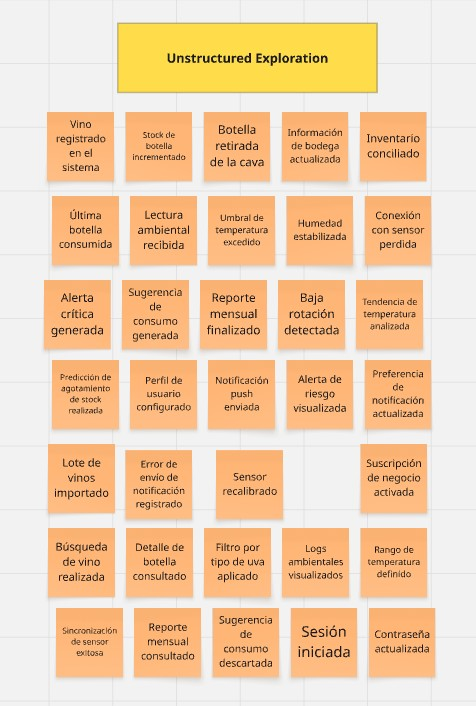</td>
Step 2: Timelines
<td> 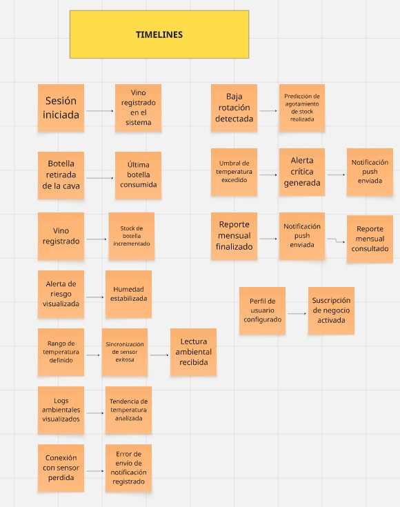</td>
Step 3: Paint Points
<td> 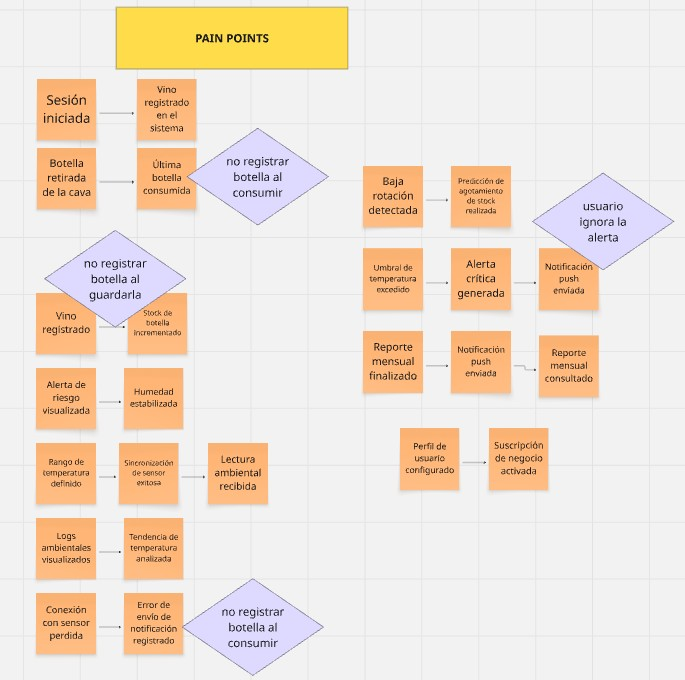</td>
Step 4: Pivotal Points
<td> 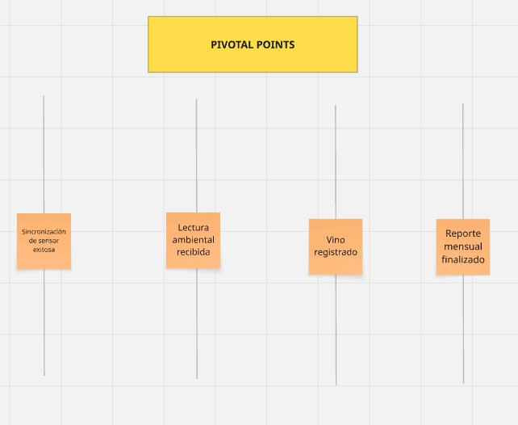</td>
Step 5: Commands
<td> 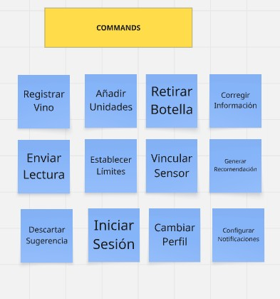</td>
Step 6: Policies
<td> 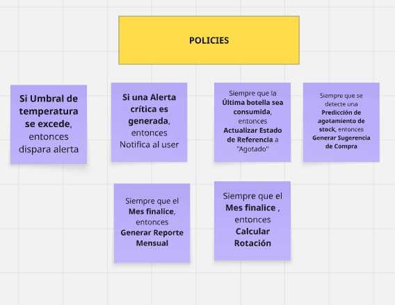</td>
Step7: ReadModels
<td> 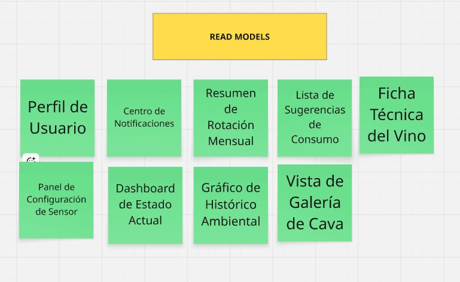</td>
Step 8: External Systems
<td> 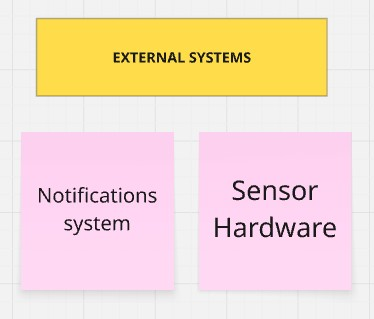</td>
Step 9: Aggregates
<td> 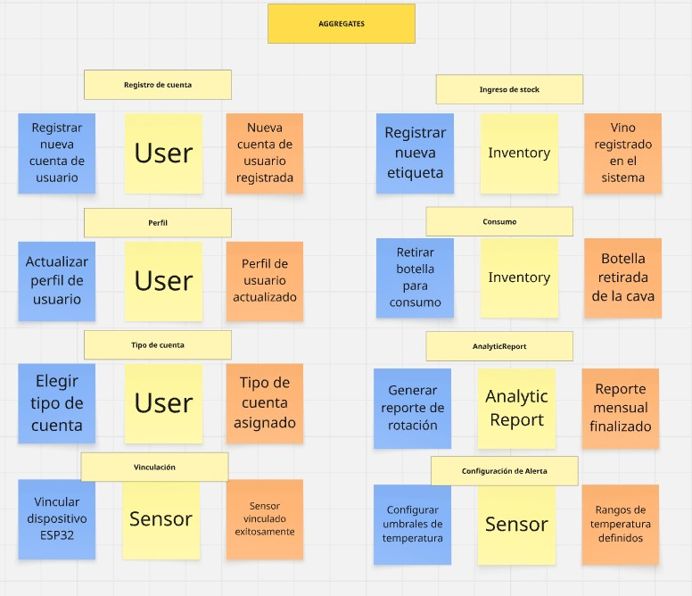</td>

### 4.2.2. Candidate Context Discovery.

<td> 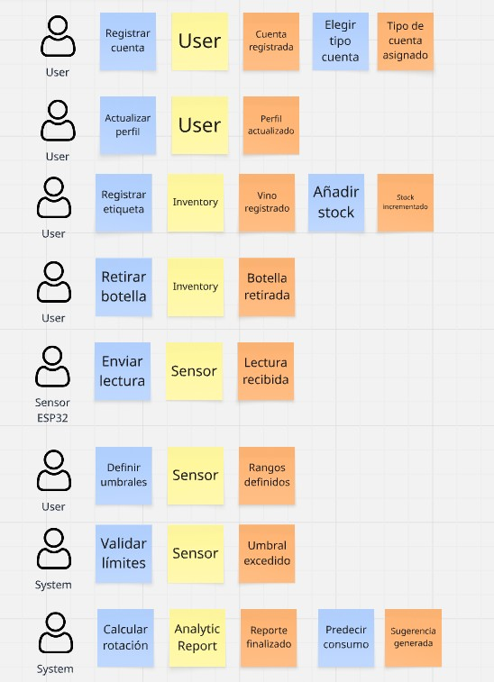</td>

### 4.2.3. Domain Message Flows Modeling.

<td> 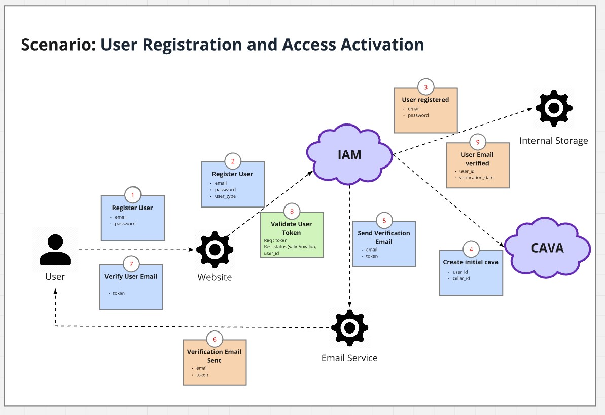</td>

<td> 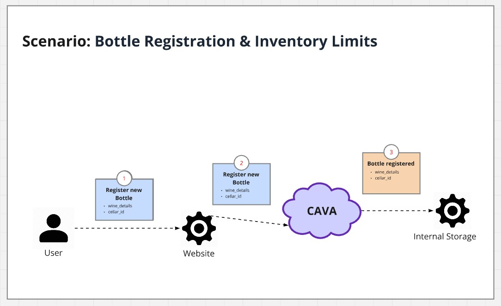</td>

<td> 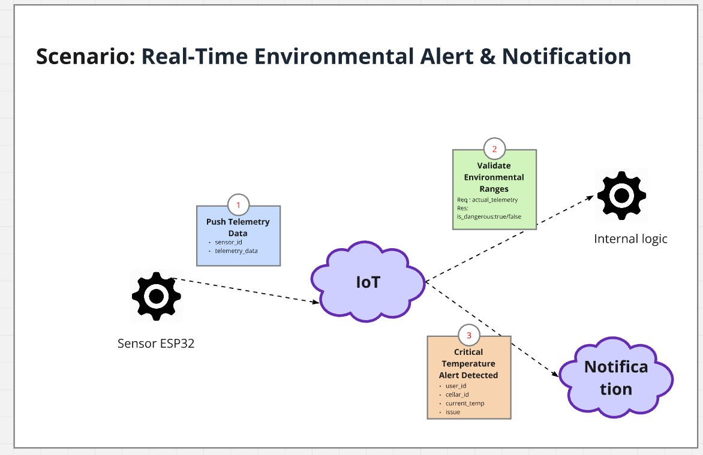</td>

<td> 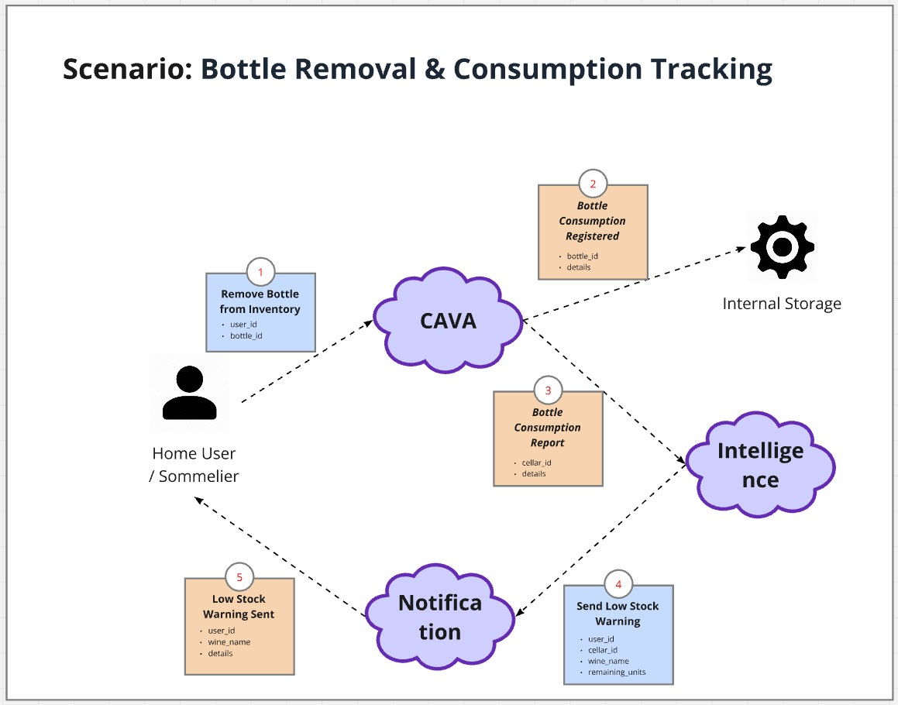</td>

### 4.2.4. Bounded Context Canvases.
En esta sección el equipo diseña sus candidate bounded contexts, detallando los 
criterios de diseño. El equipo debe ir seleccionando cada bounded context, por 
orden de importancia, para elaborar su Bounded Context Canvas. La elaboración del 
Bounded Context Canvas debe seguir un proceso iterativo con los pasos de Context 
Overview Definition, Business Rules Distillation & Ubiquitous Language Capture, 
Capability Analysis, Capability Layering (si aplica), Dependencies Capture, y Design 
Critique.

### 4.2.5. Context Mapping.
En esta sección el equipo explica y evidencia el proceso de elaboración de un 
conjunto de contexts maps (visualizaciones de las relaciones estructurales entre 
bounded contexts). Para ello el equipo revisa información recolectada y la utiliza 
para producir los diseños candidatos. Se recomienda en el proceso incluir preguntas 
como: “¿qué pasaría si movemos este capability a otro bounded context?”, “¿qué 
pasaría si descomponemos este capability y movemos uno de los sub-capabilities a 
otro bounded context?”, “¿qué pasaría si partimos el bounded context en múltiples 
bounded contexts?”, “¿qué pasaría si tomamos este capability de estos 3 contexts y 
lo usamos para formar un nuevo context?”, “¿qué pasaría si duplicamos una 
funcionalidad para romper la dependencia?”, “¿qué pasaría si creamos un shared
service para reducir la duplicación entre múltiples bounded contexts?”, “¿qué 
pasaría si aislamos los core capabilities y movemos los otros a un context aparte?”. 
Debe finalizar este proceso discutiendo cada alternativa de context mapping a fin de 
llegar a la mejor aproximación. Es importante que el equipo considere los patrones 
de relaciones entre Bounded Contexts establecidos en Domain-Driven Design, como 
Anti-corruption Layer, Conformist, Customer/Supplier ó Shared Kernel

## 4.3. Software Architecture.

### 4.3.1. Software Architecture System Landscape Diagram.
### 4.3.2. Software Architecture Context Level Diagrams.
### 4.3.3. Software Architecture Container Level Diagrams.
### 4.3.4. Software Architecture Deployment Diagrams.
