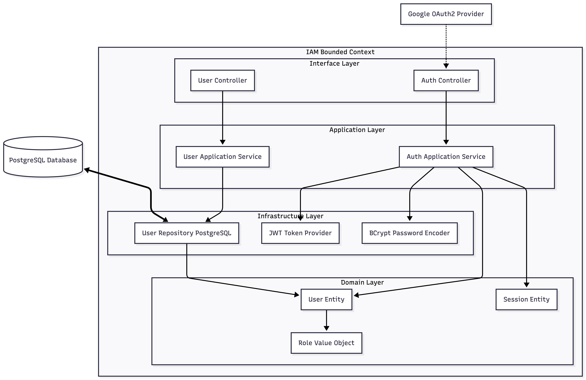
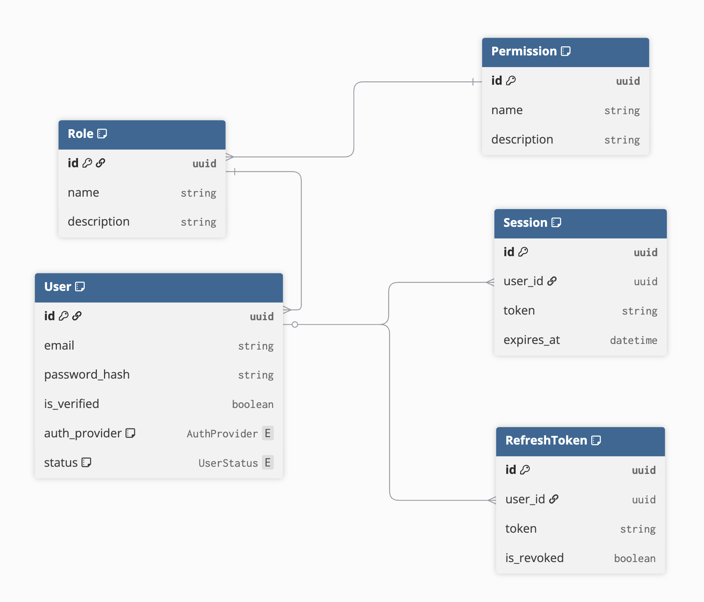
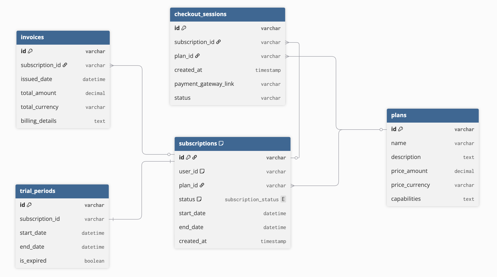
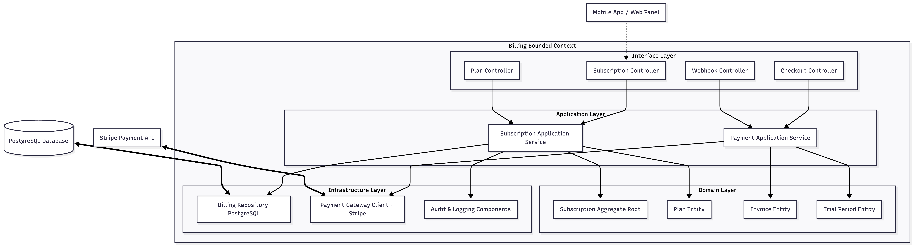
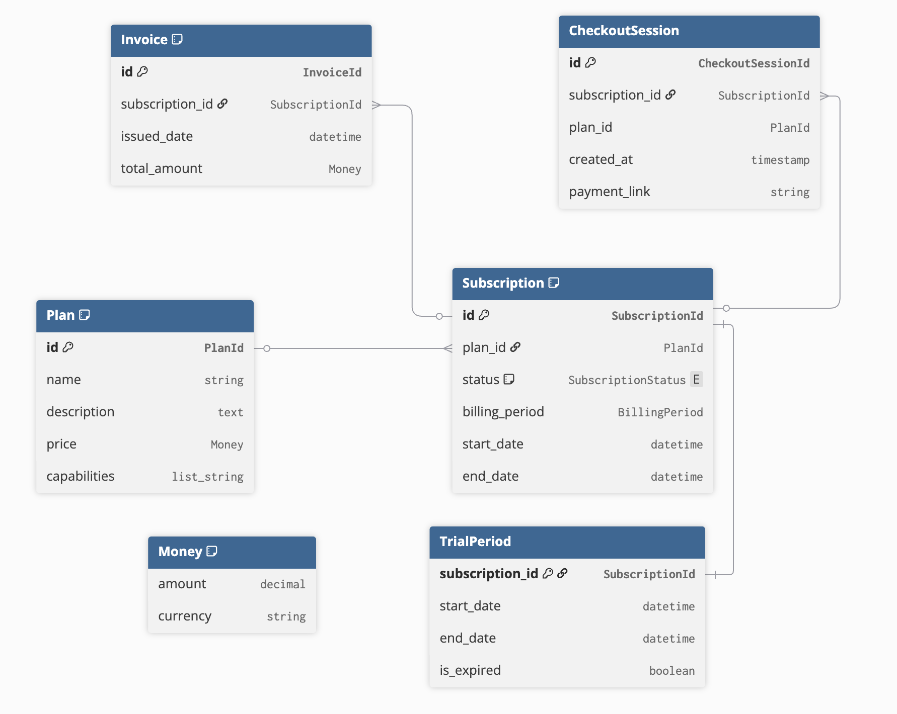

# Capítulo V: Tactical-Level Software Design.
## 5.1.Bounded Context: Identity & Access Management
El Bounded Context de Identidad y Acceso agrupa las funcionalidades vinculadas a la autenticación, autorización y gestión del acceso dentro de la plataforma. Su propósito es garantizar una correcta identificación de cada usuario, una administración segura de sus sesiones y un control de permisos que regule el acceso a las distintas funciones del sistema conforme al rol asignado a cada usuario.
### 5.1.1. Domain Layer.
La capa de dominio del Bounded Context Identity & Access (IAM) en VineVault concentra las reglas de negocio relacionadas con la identidad de los usuarios, la autenticación, la autorización y la gestión del ciclo de vida de las sesiones. Su propósito es mantener la coherencia del modelo mediante conceptos propios del dominio, evitando dependencias con tecnologías específicas como bases de datos, frameworks o servicios externos.

Dentro de VineVault, este contexto es fundamental ya que define quién puede acceder al sistema, bajo qué condiciones puede hacerlo y qué funcionalidades puede utilizar una vez autenticado. Esto resulta especialmente relevante considerando que la plataforma diferencia claramente entre perfiles de usuario con distintos niveles de acceso.

| Elemento          | Descripción                                                                                                                                                          |
| ----------------- | -------------------------------------------------------------------------------------------------------------------------------------------------------------------- |
| **User**          | Representa al usuario registrado en VineVault. Contiene su identidad, estado de cuenta, proveedor de autenticación y roles asignados.                                |
| **Role**          | Define el tipo de usuario dentro del sistema (Home User o Facility Admin), determinando su alcance funcional.                                                        |
| **Permission**    | Representa las acciones autorizadas dentro de la plataforma, utilizadas para controlar el acceso a funcionalidades como inventario, analítica o gestión de usuarios. |
| **Session**       | Representa una sesión autenticada activa, asociada a un usuario y con un tiempo de validez definido.                                                                 |
| **Refresh Token** | Credencial utilizada para renovar sesiones sin requerir reautenticación, bajo políticas de seguridad como rotación de tokens.                                        |
| **Auth Provider** | Define el origen de autenticación del usuario, pudiendo ser local (email/password) o federado (por ejemplo, Google OAuth2).                                          |

**Reglas de negocio**

Las reglas principales de la capa de dominio son las siguientes:

| Regla de negocio             | Descripción                                                                                                                                                        |
| ---------------------------- | ------------------------------------------------------------------------------------------------------------------------------------------------------------------ |
| **Unicidad de identidad**    | No puede existir más de una cuenta activa asociada al mismo correo electrónico dentro de la plataforma.                                                            |
| **Verificación previa**      | Las cuentas registradas mediante email y password deben verificar su correo antes de acceder a funcionalidades como gestión de inventario, telemetría o analítica. |
| **Roles obligatorios**       | Todo usuario autenticado debe poseer al menos un rol válido (Home User o Facility Admin), el cual define su alcance sobre los módulos del sistema.                 |
| **Sesión válida**            | Ninguna operación protegida (ej. registrar botellas, consultar analítica, recibir alertas) puede ejecutarse sin una sesión activa o un token de acceso válido.     |
| **Rotación de credenciales** | Cada uso válido del refresh token invalida el anterior y genera uno nuevo, reduciendo el riesgo de reutilización indebida.                                         |
| **Revocación inmediata**     | La desactivación de la cuenta o el cierre de sesión debe invalidar todas las sesiones activas asociadas al usuario.                                                |

Estas reglas garantizan la integridad del modelo de identidad y acceso, alineando el comportamiento del sistema con los requerimientos funcionales del IAM (registro, autenticación, autorización y gestión de sesiones), así como con los requerimientos no funcionales de seguridad, tales como control de acceso, expiración de sesiones y protección frente a uso indebido de credenciales.

### 5.1.2. Interface Layer.

La capa de interfaz del Bounded Context Identity & Access (IAM) en VineVault expone las capacidades del dominio hacia los distintos clientes del sistema, principalmente la aplicación móvil (canal principal), el panel web (analítica avanzada) y la landing page. Su responsabilidad es recibir solicitudes, validarlas, transformarlas en comandos o consultas y delegar su ejecución a la capa de aplicación, manteniendo desacoplada la lógica de presentación de las reglas de negocio.

En esta capa se ubican los controladores HTTP, los objetos de transferencia de datos (DTOs), los mecanismos de validación de entrada y los filtros de seguridad necesarios para proteger los recursos del sistema. Desde la perspectiva del usuario, esta capa representa la puerta de entrada a procesos como registro, autenticación, verificación de cuenta, renovación de sesión y cierre de sesión.

Endpoints Principales

| Endpoint u operación             | Tipo de acceso     | Propósito                                                          |
| -------------------------------- | ------------------ | ------------------------------------------------------------------ |
| **POST /auth/register**          | Público            | Registrar un nuevo usuario mediante email y password.              |
| **POST /auth/login**             | Público            | Autenticar al usuario y emitir credenciales de acceso.             |
| **POST /auth/verify-email**      | Público            | Confirmar la identidad del usuario mediante token de verificación. |
| **POST /auth/refresh**           | Público controlado | Renovar la sesión usando un refresh token válido.                  |
| **POST /auth/logout**            | Protegido          | Revocar la sesión actual del usuario.                              |
| **POST /auth/oauth/google**      | Público            | Autenticación federada mediante Google.                            |
| **GET /auth/me**                 | Protegido          | Obtener información del usuario autenticado.                       |
| **PATCH /users/{id}/deactivate** | Protegido          | Desactivar una cuenta y revocar sus sesiones.                      |

### 5.1.3. Application Layer.
La capa de aplicación del Bounded Context Identity & Access (IAM) en VineVault se encarga de orquestar los casos de uso que materializan los procesos de autenticación y autorización definidos por el negocio. A diferencia de la capa de dominio, esta capa no contiene reglas fundamentales, sino que coordina la interacción entre entidades, repositorios, políticas de seguridad, servicios externos y eventos necesarios para ejecutar cada flujo de manera consistente.

Su propósito es traducir las acciones del usuario en operaciones concretas sobre el dominio, garantizando que se respeten las reglas de seguridad y acceso a los distintos módulos del sistema, como inventario, telemetría y analítica.

| Caso de uso                | Descripción                                                                                                        |
| -------------------------- | ------------------------------------------------------------------------------------------------------------------ |
| **RegisterUser**           | Registra un nuevo usuario, valida la unicidad del correo y activa el flujo de verificación.                        |
| **VerifyEmail**            | Confirma la cuenta del usuario y habilita el acceso a funcionalidades como gestión de cava y consulta de sensores. |
| **LoginUser**              | Valida credenciales o identidad federada, crea una sesión y emite tokens de acceso.                                |
| **RefreshSession**         | Renueva la sesión autenticada mediante rotación segura de refresh tokens.                                          |
| **LogoutUser**             | Revoca la sesión actual y evita el reuso de credenciales invalidadas.                                              |
| **DeactivateAccount**      | Desactiva la cuenta del usuario y revoca todas sus sesiones activas.                                               |
| **AssignRoleToUser**       | Asigna o modifica el rol del usuario (Home User o Facility Admin).                                                 |
| **AuthenticateWithGoogle** | Procesa la autenticación federada y la adapta al modelo interno de VineVault.                                      |

### 5.1.4. Infrastructure Layer.
La capa de infraestructura del Bounded Context Identity & Access (IAM) en VineVault implementa los mecanismos técnicos que permiten materializar las necesidades del dominio y de la capa de aplicación en el entorno real de ejecución. En esta capa se concretan aspectos como la persistencia de datos, la autenticación, la gestión de tokens y la integración con proveedores externos de identidad.

Las decisiones tecnológicas adoptadas priorizan bajo costo, simplicidad operativa y facilidad de mantenimiento, manteniendo al mismo tiempo un nivel adecuado de seguridad, escalabilidad y desacoplamiento arquitectónico.

| Recurso                       | Responsabilidad                                                                         |
| ----------------------------- | --------------------------------------------------------------------------------------- |
| **PostgreSQL**                | Persistir usuarios, roles, permisos y relaciones de autorización de forma estructurada. |
| **JWT Provider (stateless)**  | Generar y validar access tokens para autenticación en endpoints protegidos.             |
| **Password Encoder (bcrypt)** | Hashear y verificar contraseñas de forma segura.                                        |
| **Google OAuth2**  | Permitir autenticación federada sin gestionar credenciales directamente.                |

### 5.1.6. Bounded Context Software Architecture Component Level Diagrams.

A continuación, se presenta el diagrama de arquitectura a nivel de componentes para el Bounded Context de Identity & Access Management (IAM), el cual describe de manera detallada la interacción y las responsabilidades de las capas de interfaz, aplicación, dominio e infraestructura diseñadas para garantizar la seguridad.

 

### 5.1.7. Bounded Context Software Architecture Code Level Diagrams.
#### 5.1.7.1.Bounded Context Domain Layer Class Diagrams.

Se detalla el diagrama de clases de la capa de dominio para el Bounded Context de Identity & Access Management (IAM), ilustrando las entidades y reglas lógicas que aseguran la correcta identificación, administración de sesiones y control de acceso

 

#### 5.1.7.2.Bounded Context Database Design Diagram.

Se presenta el diseño físico de la base de datos para el Bounded Context de Billing, detallando la estructura de tablas y relaciones que soportan la gestión de suscripciones y facturación.

 

## 5.2.Bounded Context: Billing
El Bounded Context Billing agrupa la lógica de negocio vinculada a planes, suscripciones, checkout, pagos e invoices dentro de VineVault. Su responsabilidad es gobernar el acceso a las capacidades del sistema según el tipo de usuario, permitiendo diferenciar entre funcionalidades básicas de gestión de cava y capacidades avanzadas como analítica histórica, multiusuario y monitoreo extendido.

### 5.2.1. Domain Layer.
La capa de dominio del Bounded Context Billing en VineVault concentra las reglas de negocio relacionadas con planes, suscripciones, cobros, facturación y control de acceso a funcionalidades avanzadas del sistema. Su objetivo es representar de manera explícita cómo se gestiona el acceso a capacidades como analítica, monitoreo histórico y gestión multiusuario, así como las condiciones bajo las cuales un usuario adquiere, mantiene o pierde dichos beneficios.

Este contexto tiene un rol estratégico dentro del sistema, ya que conecta directamente la propuesta de valor de VineVault con su sostenibilidad operativa. A diferencia de enfoques tradicionales que limitan el uso en función del volumen de inventario, VineVault implementa un modelo de monetización por valor añadido, donde las restricciones y beneficios están definidos por el nivel de inteligencia y control que el sistema proporciona al usuario.

En este sentido, el dominio de Billing no controla cuánto puede almacenar un usuario, sino qué tan avanzadas son las capacidades a las que puede acceder.

| Elemento del dominio | Descripción                                                                                        |
| -------------------- | -------------------------------------------------------------------------------------------------- |
| Subscription         | Representa la relación activa o inactiva entre un usuario (o negocio) y un plan.                   |
| Plan                 | Define las capacidades habilitadas, como acceso a analítica, historial de sensores o multiusuario. |
| Checkout Session     | Representa el proceso temporal de pago antes de su confirmación.                                   |
| Invoice              | Representa la evidencia de una transacción económica o ciclo de facturación.                       |
| Payment Outcome      | Representa el resultado del intento de cobro (exitoso o fallido).                                  |
| Trial Period         | Representa el periodo inicial con acceso a funcionalidades avanzadas por tiempo limitado.          |

El agregado central de este bounded context es Subscription, ya que desde esta raíz se gobiernan decisiones como el plan contratado, su estado actual, la duración del trial, la renovación, la cancelación y el impacto funcional de estos cambios sobre el resto del sistema.

Como soporte semántico, el modelo incorpora objetos de valor como PlanId, SubscriptionStatus, BillingPeriod, Money, InvoiceId y CheckoutSessionId, los cuales permiten expresar conceptos del negocio con consistencia y precisión.

**Modelo de planes basado en capacidades**
| Plan               | Capacidades                                                                                                                 |
| ------------------ | --------------------------------------------------------------------------------------------------------------------------- |
| Home (Freemium)    | Gestión de inventario ilimitado, monitoreo en tiempo real, historial limitado de sensores, sin analítica avanzada           |
| Business (Premium) | Inventario ilimitado, historial completo, analítica avanzada, reportes de rotación, sugerencias inteligentes y multiusuario |

Este diseño refleja que el sistema no impone límites sobre la cantidad de botellas, sino sobre el nivel de inteligencia y control disponible para el usuario.

**Reglas de negocio**

Las reglas principales de la capa de dominio son las siguientes:

| Regla de negocio             | Descripción                                                                                                                      |
| ---------------------------- | -------------------------------------------------------------------------------------------------------------------------------- |
| Monetización por capacidades | El acceso a funcionalidades se define por el nivel de análisis y control habilitado, no por la cantidad de botellas registradas. |
| Trial inicial                | Todo usuario nuevo puede acceder a un periodo de prueba con capacidades Business por tiempo limitado.                            |
| Downgrade automático         | Al finalizar el trial sin activación de pago, el usuario regresa al plan Home con restricciones en analítica e historial.        |
| Activación por pago válido   | Una suscripción Business solo se activa cuando el pago ha sido confirmado.                                                       |
| Persistencia del estado      | Todo cambio en la suscripción debe mantenerse de forma consistente y auditable.                                                  |
| Restricción de capacidades   | Funcionalidades avanzadas como analítica histórica, reportes y multiusuario solo están disponibles con suscripción activa.       |
| Ventana de datos             | Usuarios Freemium acceden únicamente a un historial limitado de datos de sensores.                                               |
| Cancelación controlada       | La cancelación implica la pérdida de capacidades avanzadas, manteniendo acceso básico al inventario.                             |
| Inventario sin restricciones | No existe límite en la cantidad de botellas para ningún plan.                                                                    |

### 5.2.2. Interface Layer.
La capa de interfaz del Bounded Context Billing en VineVault expone al exterior los procesos vinculados a suscripciones, consulta de planes, gestión de capacidades habilitadas, checkout, facturación y control del ciclo comercial del usuario. Su responsabilidad es recibir solicitudes provenientes de la Mobile App y del Panel Web, validarlas y delegarlas a la capa de aplicación mediante contratos claros y consistentes.

Desde la experiencia de usuario, esta capa representa el punto de contacto con las operaciones comerciales del sistema. A través de ella, el usuario puede comprender qué capacidades están disponibles en cada plan, activar un periodo de prueba, contratar el plan Business, consultar el estado de su suscripción y verificar si tiene acceso a funcionalidades avanzadas como analítica histórica o monitoreo extendido.

| Endpoint u operación               | Tipo de acceso     | Propósito                                                                                         |
| ---------------------------------- | ------------------ | ------------------------------------------------------------------------------------------------- |
| GET /billing/plans                 | Público            | Consultar el catálogo de planes y las capacidades asociadas (analítica, historial, multiusuario). |
| GET /billing/subscription          | Protegido          | Recuperar el estado actual de la suscripción y capacidades habilitadas del usuario.               |
| POST /billing/trial/start          | Protegido          | Iniciar el periodo de prueba con acceso a funcionalidades Business.                               |
| POST /billing/checkout-session     | Protegido          | Crear una sesión de pago para activar o cambiar a plan Business.                                  |
| POST /billing/webhooks/stripe      | Externo controlado | Recibir eventos del proveedor de pagos (confirmación, renovación, fallo, cancelación).            |
| PATCH /billing/subscription/cancel | Protegido          | Solicitar la cancelación de la suscripción activa.                                                |
| GET /billing/invoices              | Protegido          | Consultar el historial de facturación del usuario o negocio.                                      |

### 5.2.3. Application Layer.
La capa de aplicación del Bounded Context Billing en VineVault orquesta los casos de uso relacionados con el ciclo comercial del usuario, desde el inicio del periodo de prueba hasta la activación, renovación, cambio o cancelación de la suscripción. Su propósito es coordinar las entidades del dominio, repositorios, integraciones externas y la publicación de eventos, garantizando que cada transición comercial se ejecute de forma consistente y alineada con el modelo de monetización basado en capacidades.

A diferencia de sistemas tradicionales, esta capa no gestiona restricciones por volumen, sino que controla la habilitación o restricción de funcionalidades como analítica histórica, monitoreo extendido y gestión multiusuario.

| Caso de uso             | Descripción                                                                                         |
| ----------------------- | --------------------------------------------------------------------------------------------------- |
| StartTrialSubscription  | Inicia el periodo de prueba habilitando temporalmente capacidades Business para usuarios elegibles. |
| CreateCheckoutSession   | Genera una sesión de pago con el proveedor externo para contratar o actualizar el plan.             |
| ConfirmPaymentOutcome   | Procesa el resultado del pago y determina si se debe activar o rechazar la suscripción.   |
| ActivateSubscription    | Activa la suscripción Business y habilita capacidades avanzadas del sistema.                        |
| ChangePlan              | Gestiona el cambio entre planes ajustando dinámicamente las capacidades disponibles.                |
| CancelSubscription      | Cancela la suscripción y restringe el acceso a funcionalidades avanzadas.                           |
| ExpireTrialAndDowngrade | Detecta la expiración del trial y aplica downgrade automático al plan Home.                         |
| GetSubscriptionStatus   | Expone el estado comercial actual y las capacidades habilitadas del usuario.                        |

### 5.2.4. Infrastructure Layer.
La capa de infraestructura del Bounded Context Billing en VineVault implementa los componentes técnicos necesarios para soportar la persistencia de planes y suscripciones, la integración con el proveedor de pagos, el registro de facturación y el procesamiento seguro de eventos externos asociados al cobro. Esta capa traduce las necesidades del dominio comercial en mecanismos concretos de almacenamiento, comunicación e interoperabilidad.

En el contexto de VineVault, Billing se apoya principalmente en PostgreSQL para la persistencia de información comercial, y en un proveedor externo de pagos (como Stripe) para la gestión de checkout, confirmación de pagos y notificación de eventos. Asimismo, esta capa se integra con componentes compartidos del sistema para logging, auditoría, configuración segura y gestión de credenciales.

| Recurso de infraestructura        | Responsabilidad                                                                                |
| --------------------------------- | ---------------------------------------------------------------------------------------------- |
| PostgreSQL                        | Persistir planes, suscripciones, historial de facturación y relación con usuarios o negocios.  |
| Payment Provider API  | Crear sesiones de pago, gestionar renovaciones y notificar resultados de transacciones.        |
| Webhook Handler                   | Recibir, validar y procesar eventos externos de pago (confirmaciones, fallos, cancelaciones).  |
| Billing Repository Adapter        | Implementar el acceso persistente a entidades como Subscription, Plan e Invoice.               |
| Audit and Logging Components      | Registrar cambios de estado comercial, errores de pago y eventos relevantes para trazabilidad. |
| Secure Configuration Manager      | Gestionar credenciales, claves API y configuraciones sensibles del proveedor de pagos.         |

### 5.2.6. Bounded Context Software Architecture Component Level Diagrams.

Se presenta el diagrama de arquitectura a nivel de componentes para el Bounded Context de Billing, el cual ilustra la organización de las capas de interfaz, aplicación, dominio e infraestructura encargadas de gestionar el ciclo comercial y la habilitación de capacidades premium

 

### 5.2.7. Bounded Context Software Architecture Code Level Diagrams.
#### 5.2.7.1.Bounded Context Domain Layer Class Diagrams.

Se presenta el diagrama de clases de la capa de dominio para el Bounded Context de Billing, el cual define la estructura lógica del agregado Subscription y sus entidades relacionadas (Plan, Invoice, TrialPeriod), asegurando que la monetización de VineVault se gestione mediante la habilitación dinámica de capacidades.

 

#### 5.2.7.2.Bounded Context Database Design Diagram.

Se presenta el diagrama de clases de la capa de dominio para el Bounded Context de Billing, el cual define la estructura lógica del agregado Subscription y sus entidades relacionadas (Plan, Invoice, TrialPeriod), asegurando que la monetización de VineVault se gestione mediante la habilitación dinámica de capacidades.

 

## 5.3.Bounded Context: Notification
El Bounded Context Notification centraliza la gestión del envío de comunicaciones hacia los usuarios de VineVault, incluyendo alertas críticas, mensajes informativos y notificaciones derivadas de eventos del sistema. Su finalidad es proporcionar una capacidad transversal de comunicación que permita a otros bounded contexts informar situaciones relevantes, como anomalías ambientales, recordatorios de consumo o actualizaciones del sistema, manteniendo consistencia, trazabilidad y control sobre cada envío.

### 5.3.1. Domain Layer.
La capa de dominio del Bounded Context Notification modela la gestión de mensajes, solicitudes de envío, canales de comunicación y trazabilidad de las notificaciones emitidas por VineVault. Su responsabilidad es asegurar que los eventos generados por otros bounded contexts, como Environmental Monitoring o Inventory Intelligence, puedan traducirse en comunicaciones efectivas, consistentes y alineadas con las preferencias del usuario.

Este contexto no decide cuándo ocurre una anomalía térmica o cuándo debe generarse una recomendación de consumo; su función es encargarse del ciclo de vida de la notificación resultante. Por ello, constituye una capacidad transversal de soporte para otro BC.

| **Elemento del dominio**     | **Descripción**                                                                                             |
| ---------------------------- | ----------------------------------------------------------------------------------------------------------- |
| Notification Message         | Representa el contenido de la notificación generada, incluyendo título, cuerpo y metadata contextual.       |
| Delivery Request             | Representa una solicitud concreta de envío dirigida a uno o varios usuarios.                                |
| Delivery Channel             | Representa el medio de comunicación utilizado, como notificaciones push o correo electrónico.               |
| Notification History         | Representa el registro trazable de notificaciones enviadas, pendientes o fallidas.                          |
| User Notification Preference | Representa la configuración del usuario respecto a los canales habilitados y la frecuencia de notificación. |

**Reglas de negocio**

Las reglas de dominio incluyen respetar las preferencias de notificación del usuario, garantizar que los mensajes críticos tengan prioridad, registrar el resultado de cada intento de entrega y permitir reintentos en caso de fallos. Asimismo, el sistema debe soportar tanto notificaciones en tiempo real como comunicaciones informativas derivadas de análisis periódicos.

### 5.3.2. Interface Layer.
La capa de interfaz del Bounded Context Notification expone operaciones relacionadas con la consulta del historial de notificaciones, la gestión de preferencias del usuario y la recepción de solicitudes internas de envío provenientes de otros bounded contexts de VineVault. Asimismo, actúa como el punto de entrada que permite traducir eventos del sistema, como anomalías ambientales o recomendaciones de consumo, en solicitudes formales de notificación.

| **Endpoint u operación**         | **Tipo de acceso** | **Propósito**                                                                                              |
| -------------------------------- | ------------------ | ---------------------------------------------------------------------------------------------------------- |
| GET /notifications/history       | Protegido          | Consultar el historial de notificaciones enviadas al usuario, incluyendo estado y tipo de mensaje.         |
| PATCH /notifications/preferences | Protegido          | Configurar canales habilitados (push, email) y preferencias de recepción del usuario.                      |
| GET /notifications/settings      | Protegido          | Obtener la configuración actual de notificaciones del usuario.                                             |
| POST /notifications/send         | Interno controlado | Registrar una solicitud de envío generada por otros bounded contexts (ej. alerta térmica o recomendación). |
| POST /notifications/test         | Protegido          | Permitir al usuario validar la configuración mediante el envío de una notificación de prueba.              |

La interfaz se apoya en contratos como NotificationHistoryResponse, NotificationPreferenceRequest, NotificationSettingsResponse y DeliveryRequestDto. Estos contratos definen la estructura de los datos intercambiados entre clientes, otros bounded contexts y el sistema de notificaciones.

Las validaciones de esta cap5.1.6. Bounded Context Software Architecture Component Level Diagrams.
a se enfocan en verificar la identidad del usuario autenticado, la consistencia de los canales seleccionados, la existencia de destinatarios válidos y la integridad de los datos necesarios para construir el mensaje. En el caso de solicitudes internas, se asegura además que provengan de bounded contexts autorizados como Environmental Monitoring BC o Inventory Intelligence BC.

De este modo, la Interface Layer de Notification habilita una comunicación estructurada entre los eventos del sistema y la capacidad especializada de envío de mensajes, permitiendo que VineVault entregue información crítica de manera confiable y controlada.

### 5.3.3. Application Layer.
La capa de aplicación del Bounded Context Notification coordina la transformación de eventos del sistema en notificaciones concretas dirigidas a los usuarios. Su responsabilidad es orquestar la selección del contenido, la resolución de destinatarios, la evaluación de preferencias y el despacho de mensajes a través de los canales disponibles, garantizando trazabilidad en todo el proceso.

En el contexto de VineVault, esta capa permite convertir eventos como anomalías de temperatura, pérdida de conexión con sensores o recomendaciones de consumo en comunicaciones efectivas hacia el usuario final.

| **Caso de uso**              | **Descripción**                                                                                                                            |
| ---------------------------- | ------------------------------------------------------------------------------------------------------------------------------------------ |
| RequestNotificationDelivery  | Registrar una solicitud de envío proveniente de otros bounded contexts, como Environmental Monitoring o Inventory Intelligence.            |
| ResolveRecipients            | Determinar los destinatarios efectivos en función del usuario asociado a la cava y sus preferencias configuradas.                          |
| EvaluateNotificationPriority | Clasificar la notificación según su criticidad (por ejemplo, alertas críticas vs. mensajes informativos).                                  |
| RenderNotificationMessage    | Construir el contenido final del mensaje utilizando datos de contexto (ej. temperatura actual, nombre de la cava, recomendación generada). |
| DispatchNotification         | Enviar la notificación a través del canal correspondiente, como push móvil o correo electrónico.                                           |
| RecordDeliveryOutcome        | Registrar el resultado de la entrega, incluyendo éxito, fallo o reintento.                                                                 |

Estos casos de uso pueden implementarse mediante servicios como NotificationAppService, NotificationRoutingService, MessageRenderingService y NotificationHistoryService. La coordinación entre estos servicios permite desacoplar la intención de comunicar (generada por otros bounded contexts) de la lógica concreta de construcción y envío del mensaje.

Adicionalmente, esta capa puede integrar mecanismos de priorización y manejo de eventos en tiempo real, asegurando que notificaciones críticas (como una temperatura fuera de rango que pueda dañar el vino) sean procesadas y enviadas con mayor urgencia que comunicaciones informativas.

De este modo, la Application Layer de Notification actúa como el orquestador que transforma solicitudes abstractas de comunicación en notificaciones concretas, asegurando que cada mensaje enviado por VineVault tenga el contenido, canal y nivel de prioridad adecuados según el contexto de negocio.

### 5.3.4. Infrastructure Layer.
La capa de infraestructura del Bounded Context Notification implementa los mecanismos técnicos necesarios para la persistencia del historial de notificaciones, la gestión de solicitudes de envío y la integración con proveedores externos de mensajería. En el contexto de VineVault, esta capa permite materializar el envío de alertas críticas —como anomalías de temperatura o fallos de conexión con sensores— mediante canales como notificaciones push y correo electrónico.

Siguiendo la arquitectura del sistema, este contexto se apoya en PostgreSQL para la trazabilidad de notificaciones y en servicios externos como Firebase Cloud Messaging (FCM) para notificaciones push y proveedores SMTP o APIs de email transaccional para el envío de correos.

| **Recurso de infraestructura**    | **Responsabilidad**                                                                     |
| --------------------------------- | --------------------------------------------------------------------------------------- |
| PostgreSQL                        | Persistir solicitudes de envío, historial de notificaciones y preferencias del usuario. |
| Firebase Cloud Messaging (FCM)    | Gestionar el envío de notificaciones push en tiempo real hacia dispositivos móviles.    |
| Email Service Provider (SMTP/API) | Ejecutar el envío de correos electrónicos para alertas o comunicaciones informativas.   |
| Delivery Repository Adapter       | Registrar resultados de envío, estados de notificación y reintentos.                    |
| Notification Channel Adapter      | Abstraer la integración con distintos canales (push, email).                            |

Las estructuras principales de persistencia pueden incluir notification_requests, notification_history y user_notification_preferences, permitiendo mantener un registro completo de cada comunicación emitida por el sistema.

Adicionalmente, la infraestructura debe soportar mecanismos de reintentos automáticos ante fallos de entrega, registro de logs para diagnóstico y capacidades de observabilidad que permitan monitorear métricas como tasa de éxito, latencia de envío y frecuencia de alertas críticas. Esto resulta especialmente importante en VineVault, donde una notificación tardía o fallida puede comprometer la conservación de la cava.

En consecuencia, la Infrastructure Layer de Notification hace operativa la capacidad comunicacional de VineVault, conectando las decisiones del negocio con servicios reales de mensajería y garantizando la trazabilidad completa de cada notificación enviada.

### 5.3.6. Bounded Context Software Architecture Component Level Diagrams.
### 5.3.7. Bounded Context Software Architecture Code Level Diagrams.
#### 5.3.7.1.Bounded Context Domain Layer Class Diagrams.
#### 5.3.7.2.Bounded Context Database Design Diagram.

## 5.4.Bounded Context: Wine Inventory
El Bounded Context Wine Inventory modela el núcleo transaccional de VineVault, representando las botellas de vino, su estado dentro de la cava y las operaciones asociadas a su ciclo de vida. Este contexto permite mantener una representación precisa y actualizada del inventario, sirviendo como base para la analítica, recomendaciones y control operativo del sistema.

Este contexto es considerado el Core Domain, ya que concentra el valor principal del negocio: la gestión inteligente de colecciones de vino, incluyendo el registro, seguimiento y consumo de botellas.

### 5.4.1. Domain Layer.
La capa de dominio del Bounded Context Wine Inventory modela el ciclo de vida completo de las botellas dentro de la cava. Su responsabilidad es representar entidades como vinos, botellas, movimientos de inventario y estados asociados, así como las reglas que gobiernan su registro, almacenamiento, consulta y descorche.

Este contexto es fundamental porque proporciona la fuente de verdad del inventario sobre la cual operan otros contextos como Inventory Intelligence, que depende de estos datos para generar análisis y recomendaciones, y Notification, que reacciona ante eventos relevantes como la reducción de stock o cambios significativos en el inventario.

| Elemento del dominio | Descripción                                                                           |
| -------------------- | ------------------------------------------------------------------------------------- |
| Wine                 | Representa la información base de un vino (nombre, bodega, tipo de uva, añada, etc.). |
| Bottle               | Representa una instancia física individual de un vino dentro de la cava.              |
| Inventory            | Representa la colección de botellas asociadas a un usuario o cava.                    |
| Inventory Movement   | Representa una operación que modifica el inventario, como ingreso o descorche.        |
| Bottle Status        | Representa el estado de la botella, por ejemplo almacenada, consumida o reservada.    |
| Storage Location     | Representa la ubicación física dentro de la cava (rack, fila, posición).              |

**Reglas de negocio**

Las reglas principales de la capa de dominio son las siguientes:

| Regla                               | Descripción                                                                                                                  |
| ----------------------------------- | ---------------------------------------------------------------------------------------------------------------------------- |
| Asociación obligatoria de vino      | Toda botella registrada debe estar asociada a un vino válido previamente definido en el sistema.                             |
| Trazabilidad de movimientos         | Ninguna botella puede cambiar de estado sin registrar un movimiento de inventario (por ejemplo, un descorche o eliminación). |
| Integridad del inventario           | El inventario no puede contener cantidades negativas de botellas bajo ninguna circunstancia.                                 |
| Consistencia del vino               | Los atributos del vino (bodega, tipo de uva, añada) deben mantenerse consistentes para todas las botellas asociadas.         |
| Control de estado de botella        | Una botella solo puede tener un estado válido a la vez (almacenada, consumida, reservada, etc.).                             |
| Validez de ubicación                | Toda botella debe estar asociada a una ubicación física válida dentro de la cava.                                            |
| Registro de auditoría               | Todo movimiento de inventario debe registrar información mínima: fecha, tipo de operación y usuario responsable.             |
| Restricción de transición de estado | No se permite pasar directamente de “almacenada” a “consumida” sin un evento explícito de descorche.                         |

### 5.4.2. Interface Layer.
La capa de interfaz del Bounded Context Wine Inventory expone los procesos mediante los cuales los usuarios registran vinos, agregan botellas al inventario, consultan su colección, realizan descorches y gestionan la ubicación y estado de cada botella. Su objetivo es recibir solicitudes desde la Web App y la Mobile App, validarlas y transferirlas a la capa de aplicación mediante contratos estables y entendibles.

Desde la perspectiva del usuario, esta capa es la encargada de materializar la gestión operativa de la cava. Aquí se ejecutan las acciones principales del día a día: registrar nuevas botellas, organizarlas dentro del espacio físico y reflejar su consumo, manteniendo siempre actualizado el estado del inventario.

| Endpoint u operación                   | Tipo de acceso | Propósito                                                         |
| -------------------------------------- | -------------- | ----------------------------------------------------------------- |
| POST /wines                            | Protegido      | Registrar un nuevo vino base (bodega, tipo de uva, añada, etc.).  |
| POST /inventory/bottles                | Protegido      | Agregar una o más botellas al inventario del usuario.             |
| GET /inventory                         | Protegido      | Consultar el estado actual del inventario completo.               |
| GET /inventory/bottles/{id}            | Protegido      | Obtener el detalle de una botella específica.                     |
| PATCH /inventory/bottles/{id}/location | Protegido      | Actualizar la ubicación física de una botella dentro de la cava.  |
| PATCH /inventory/bottles/{id}/status   | Protegido      | Actualizar el estado de la botella (reservada, almacenada, etc.). |
| POST /inventory/bottles/{id}/uncork    | Protegido      | Registrar el descorche de una botella (consumo).                  |
| DELETE /inventory/bottles/{id}         | Protegido      | Eliminar una botella del inventario (por ajuste o error).         |
| GET /inventory/search                  | Protegido      | Buscar botellas por atributos (uva, bodega, añada, etc.).         |

La interfaz utiliza DTOs como CreateWineRequest, AddBottleRequest, BottleDetailsResponse, InventoryResponse, UpdateBottleLocationRequest, UpdateBottleStatusRequest y UncorkBottleRequest, los cuales desacoplan la comunicación externa de la representación interna del dominio. Esta separación facilita la evolución de clientes web y mobile sin comprometer la consistencia del modelo.

### 5.4.3. Application Layer.
La capa de aplicación del Bounded Context Wine Inventory coordina los casos de uso asociados a la gestión del inventario de botellas dentro de la cava. Su función es orquestar la ejecución de comandos, consultar repositorios, aplicar políticas del dominio y garantizar que los cambios en el inventario se reflejen de manera consistente y trazable en toda la plataforma.

| Caso de uso               | Descripción                                                                       |
| ------------------------- | --------------------------------------------------------------------------------- |
| CreateWine                | Registra un nuevo vino base con sus atributos (bodega, tipo de uva, añada, etc.). |
| AddBottleToInventory      | Agrega una o más botellas al inventario asociadas a un vino existente.            |
| GetInventory              | Recupera el estado actual del inventario del usuario.                             |
| GetBottleDetails          | Obtiene la información detallada de una botella específica.                       |
| UpdateBottleLocation      | Actualiza la ubicación física de una botella dentro de la cava.                   |
| UpdateBottleStatus        | Modifica el estado de la botella (almacenada, reservada, etc.).                   |
| UncorkBottle              | Registra el consumo de una botella mediante un descorche.                         |
| RemoveBottleFromInventory | Elimina una botella del inventario por ajuste o corrección.                       |
| SearchInventory           | Permite buscar botellas según atributos como uva, bodega o añada.                 |

Estos casos de uso pueden implementarse a través de servicios como WineAppService, InventoryAppService y BottleManagementAppService, donde cada uno coordina validaciones de ownership, consistencia del inventario, estado de las botellas y reglas del dominio antes de persistir los cambios.

Por ejemplo, AddBottleToInventory debe verificar que el vino exista previamente, que el usuario tenga acceso al inventario y que la operación no genere inconsistencias (como cantidades negativas). Asimismo, debe registrar el movimiento correspondiente para mantener la trazabilidad del inventario.

El caso UncorkBottle requiere validar que la botella exista, que se encuentre en estado “almacenada” y que no haya sido previamente consumida. Además, debe registrar el evento de descorche y actualizar el estado de la botella de manera consistente.

De forma similar, UpdateBottleLocation debe comprobar que la nueva ubicación sea válida dentro de la estructura de la cava, mientras que UpdateBottleStatus debe asegurar que las transiciones de estado sean coherentes con las reglas del dominio.

La capa de aplicación también es responsable de emitir eventos de dominio que luego serán consumidos por otros bounded contexts. En particular, los eventos generados por este contexto son fundamentales para Inventory Intelligence, que analiza la rotación de stock y genera recomendaciones, así como para Notification, que puede alertar sobre niveles bajos de inventario o cambios relevantes.

De este modo, Wine Inventory no solo gestiona datos transaccionales, sino que habilita semánticamente al resto del sistema al proporcionar una fuente confiable de información sobre el estado de la cava.

En conjunto, la Application Layer de Wine Inventory convierte operaciones de gestión de inventario en transacciones coherentes, persistentes y trazables. Su valor reside en garantizar que el estado digital de la colección de vinos refleje fielmente las acciones realizadas por el usuario en el mundo real, manteniendo la integridad del dominio y habilitando capacidades analíticas y de monitoreo en toda la plataforma.

### 5.4.4. Infrastructure Layer.
La capa de infraestructura del Bounded Context Wine Inventory implementa la persistencia y los adaptadores técnicos requeridos para registrar vinos, botellas, movimientos de inventario y estados asociados. En esta capa se concretan repositorios, mecanismos de almacenamiento y servicios auxiliares necesarios para sostener la gestión transaccional del inventario modelada por el dominio.

Conforme al modelo arquitectónico de VineVault, este contexto se apoya principalmente en PostgreSQL como base de datos operativa para vinos, botellas, inventarios y movimientos. Asimismo, puede integrar adaptadores para eventos internos que reflejen cambios en el inventario, permitiendo mantener sincronizados los estados persistidos con las operaciones realizadas por el usuario.

| Recurso de infraestructura   | Responsabilidad                                                          |
| ---------------------------- | ------------------------------------------------------------------------ |
| PostgreSQL                   | Persistir vinos, botellas, inventarios, movimientos y estados asociados. |
| Wine Repository Adapter      | Implementar acceso a datos para registro y consulta de vinos.            |
| Bottle Repository Adapter    | Implementar acceso a datos para gestión de botellas individuales.        |
| Inventory Repository Adapter | Gestionar la agregación y consulta del inventario por usuario.           |
| Inventory Movement Adapter   | Persistir operaciones de entrada, salida y descorche con trazabilidad.   |
| Search Adapter               | Optimizar consultas por atributos como uva, bodega o añada.              |

Las estructuras mínimas de almacenamiento pueden incluir tablas como wines, bottles, inventories, inventory_movements, bottle_status y storage_locations. Esta organización permite պահպանar trazabilidad completa sobre altas de botellas, descorches, ajustes de inventario y cambios de ubicación a lo largo del tiempo.

La infraestructura de este contexto también debe contemplar mecanismos de auditoría, validación de integridad referencial y control de concurrencia para evitar inconsistencias (por ejemplo, descorches simultáneos sobre una misma botella). Asimismo, se deben implementar capacidades de observabilidad para detectar fallos en operaciones críticas como el registro de botellas o la persistencia de movimientos.

Dado que este contexto es el núcleo transaccional del sistema, cualquier inconsistencia en esta capa puede impactar directamente en la analítica posterior (Inventory Intelligence) y en la generación de alertas o notificaciones, afectando la confiabilidad general de la plataforma.

### 5.4.6. Bounded Context Software Architecture Component Level Diagrams.
### 5.4.7. Bounded Context Software Architecture Code Level Diagrams.
#### 5.4.7.1.Bounded Context Domain Layer Class Diagrams.
#### 5.4.7.2.Bounded Context Database Design Diagram.

## 5.5.Bounded Context: Environmental Monitoring
El Bounded Context Environmental Monitoring concentra la lógica encargada de recibir, validar y procesar la telemetría ambiental proveniente de los sensores instalados en la cava (ESP32). Su finalidad es transformar lecturas crudas de temperatura y humedad en estados significativos del entorno, detectando desviaciones de condiciones óptimas, anomalías en los sensores y situaciones que puedan comprometer la conservación del vino.

Este contexto actúa como el puente entre el mundo físico y el sistema digital de VineVault, asegurando que la información ambiental sea confiable, consistente y utilizable por otros contextos como notificaciones e inteligencia de inventario.

### 5.5.1. Domain Layer.
La capa de dominio del Bounded Context Environmental Monitoring concentra las reglas de negocio relacionadas con la ingesta, validación e interpretación de la telemetría ambiental. Su objetivo es transformar lecturas crudas de temperatura y humedad en estados comprensibles del entorno, tales como condiciones óptimas, desviaciones de rango o detección de anomalías en sensores.

Este contexto constituye el núcleo de monitoreo en tiempo real de VineVault, ya que es el responsable de garantizar que las condiciones ambientales de la cava se mantengan dentro de parámetros adecuados para la conservación del vino. A partir de sus decisiones se alimentan las alertas críticas, se construyen historiales ambientales y se proveen insumos para el análisis posterior en el contexto de inteligencia.

| Elemento del dominio                 | Descripción                                                                                                                      |
| ------------------------------------ | -------------------------------------------------------------------------------------------------------------------------------- |
| Telemetry Batch                  | Representa un conjunto de lecturas recibidas desde uno o múltiples sensores en un intervalo de tiempo.                           |
| Reading                          | Representa una medición individual de temperatura o humedad en un instante específico.                                           |
| Environmental State              | Representa la clasificación semántica del entorno (óptimo, advertencia, crítico) según los thresholds definidos.                 |
| Threshold Evaluation             | Representa el resultado de comparar una lectura contra los rangos seguros establecidos para la conservación del vino.            |
| Sensor Anomaly                   | Representa una condición atípica (lecturas inconsistentes, valores imposibles o ruido) que invalida la confianza en la medición. |
| Environmental Condition Snapshot | Representa una agregación puntual del estado ambiental (por ejemplo, promedios recientes de temperatura y humedad).              |

**Reglas de negocio**

Las reglas principales de la capa de dominio son las siguientes:
| Regla                                     | Descripción                                                                                                                                           |
| ----------------------------------------- | ----------------------------------------------------------------------------------------------------------------------------------------------------- |
| Validación de rangos físicos          | Cada reading debe encontrarse dentro de rangos físicamente posibles antes de ser procesado (ej. evitar valores inválidos como temperaturas irreales). |
| Identidad y trazabilidad de lecturas  | Toda lectura debe incluir timestamp, tipo de métrica (temperatura o humedad) y origen (sensor) válido.                                                |
| No duplicación de lecturas            | El sistema no debe procesar ni almacenar lecturas duplicadas provenientes del mismo sensor y timestamp.                                               |
| Evaluación independiente por métrica  | Temperatura y humedad deben evaluarse de manera independiente contra sus respectivos thresholds.                                                      |
| Clasificación del estado ambiental    | El estado ambiental debe derivarse en función de los resultados de evaluación de thresholds (óptimo, advertencia, crítico).                           |
| Detección de superación de thresholds | Se debe generar un evento cuando una métrica excede sus límites definidos.                                                                            |
| Detección de anomalías de sensor      | Lecturas inconsistentes, abruptas o fuera de comportamiento esperado deben marcarse como anomalías y excluirse del procesamiento normal.              |
| Persistencia de lecturas válidas      | Solo las lecturas validadas deben ser almacenadas y utilizadas para análisis posteriores.                                                             |
| Idempotencia en procesamiento         | El procesamiento de un mismo Telemetry Batch no debe generar efectos duplicados.                                                                      |
| Detección de desconexión              | La ausencia prolongada de datos de un sensor debe interpretarse como posible desconexión.                                                             |

### 5.5.2. Interface Layer.
La capa de interfaz del Bounded Context Environmental Monitoring expone los procesos mediante los cuales la plataforma recibe telemetría ambiental desde los sensores de la cava, consulta estados del entorno y entrega resultados a otros bounded contexts o a las aplicaciones cliente. Su responsabilidad es aceptar entradas de datos desde dispositivos ESP32, validarlas en un nivel preliminar y permitir la consulta de condiciones ambientales hacia la Mobile App, Web App y otros módulos del sistema.

| Endpoint u operación                                | Tipo de acceso     | Propósito                                                                       |
| --------------------------------------------------- | ------------------ | ------------------------------------------------------------------------------- |
| POST /environmental/telemetry/ingest            | Sistema a sistema  | Recibir lecturas o lotes de telemetría desde sensores ESP32 autorizados.        |
| GET /environmental/devices/{id}/current         | Protegido          | Consultar el estado ambiental actual (temperatura y humedad) de un dispositivo. |
| GET /environmental/cellars/{id}/current         | Protegido          | Consultar el estado ambiental actual de una cava o espacio físico.              |
| GET /environmental/devices/{id}/history-preview | Protegido          | Recuperar una vista acotada del historial reciente para dashboards.             |
| POST /environmental/evaluate                    | Interno controlado | Forzar o disparar el proceso de evaluación de lecturas pendientes.              |

La interfaz emplea DTOs como TelemetryIngestionRequest, ReadingDto, EnvironmentalStateResponse y EnvironmentalSnapshotResponse, permitiendo que las lecturas y resultados se intercambien sin acoplar a los clientes o dispositivos con la estructura interna del dominio.

Las validaciones iniciales comprueban formato, identidad del dispositivo, timestamp, integridad del lote y consistencia mínima de las métricas antes de que la capa de aplicación procese la información. Esto asegura que únicamente datos estructuralmente válidos ingresen al sistema.

Adicionalmente, esta capa diferencia entre operaciones de ingestión y operaciones de consulta. Las primeras requieren autenticación técnica (por ejemplo, API keys o tokens asociados al dispositivo) y control sobre frecuencia de envío, mientras que las segundas requieren permisos funcionales, ya que la información ambiental está restringida al propietario de la cava o a usuarios autorizados.

### 5.5.3. Application Layer.
La capa de aplicación del Bounded Context Environmental Monitoring orquesta la secuencia completa de recepción, validación, persistencia y evaluación de la telemetría ambiental proveniente de los sensores de la cava. Su tarea principal es coordinar los componentes que transforman lecturas entrantes de temperatura y humedad en estados ambientales persistidos y eventos de negocio que pueden ser consumidos por otros contextos como Notification o Inventory Intelligence.

| Caso de uso               | Descripción                                                                                                                  |
| ------------------------- | ---------------------------------------------------------------------------------------------------------------------------- |
| IngestTelemetryBatch      | Recibe un lote de lecturas desde sensores ESP32 y coordina su validación inicial.                                            |
| ValidateReading           | Determina si una lectura cumple condiciones de formato, rango y consistencia o si debe ser rechazada o marcada como anómala. |
| PersistReading            | Almacena la lectura válida en el repositorio de datos históricos.                                                            |
| EvaluateTemperature       | Evalúa la temperatura contra los thresholds definidos para conservación del vino.                                            |
| EvaluateHumidity          | Evalúa la humedad contra los thresholds establecidos.                                                                        |
| UpdateEnvironmentalState  | Actualiza el estado ambiental de la cava en función de las evaluaciones realizadas.                                          |
| DetectSensorAnomaly       | Identifica comportamientos anormales en las lecturas o fallos del sensor.                                                    |
| DetectSensorDisconnection | Detecta la ausencia prolongada de datos como posible desconexión del sensor.                                                 |

Estos casos de uso pueden implementarse mediante servicios como TelemetryIngestionAppService, EnvironmentalEvaluationAppService, ThresholdEvaluationAppService y SensorHealthAppService. Cada servicio coordina repositorios, reglas de dominio y publicación de eventos, manteniendo idempotencia y trazabilidad sobre cada lectura procesada.

Un flujo representativo de esta capa comienza con IngestTelemetryBatch, que recibe un conjunto de lecturas desde los sensores. Luego, ValidateReading verifica formato, rangos y duplicidad, mientras PersistReading almacena los datos aceptados. Posteriormente, EvaluateTemperature y EvaluateHumidity analizan cada métrica frente a sus thresholds. Finalmente, UpdateEnvironmentalState refleja el estado actualizado de la cava y, si corresponde, se generan eventos que pueden ser consumidos por el contexto de notificaciones o por el módulo de inteligencia.

La capa de aplicación también es responsable de garantizar coherencia temporal entre lecturas, control de frecuencia de ingestión y preparación de datos para su uso en análisis históricos. Esto permite no solo reaccionar ante condiciones actuales, sino también construir una base sólida para análisis de tendencias y comportamiento ambiental.

### 5.5.4. Infrastructure Layer.
La capa de infraestructura del Bounded Context Environmental Monitoring implementa los componentes técnicos necesarios para recibir, almacenar y procesar la telemetría ambiental proveniente de los sensores de la cava. En ella se concretan los adaptadores de ingestión de datos desde dispositivos ESP32, los mecanismos de persistencia para lecturas históricas y los servicios auxiliares que permiten sostener la evaluación de condiciones ambientales en tiempo real.

Conforme al modelo definido para VineVault, esta capa se apoya en PostgreSQL para la persistencia de lecturas, estados ambientales y snapshots operativos. Dado que el sistema maneja datos de naturaleza temporal, la estructura de almacenamiento se encuentra optimizada para consultas por rango de tiempo, agregaciones y recuperación eficiente de historiales recientes. Asimismo, interactúa con productores externos (sensores ESP32) a través de APIs seguras, asegurando autenticación y control de frecuencia de envío.

| Recurso de infraestructura             | Responsabilidad                                                                               |
| -------------------------------------- | --------------------------------------------------------------------------------------------- |
| Telemetry Ingestion Adapter            | Recibir lotes de lecturas desde sensores ESP32 mediante endpoints seguros.                    |
| Time-Series Persistence Adapter        | Almacenar readings y snapshots históricos de temperatura y humedad.                           |
| Environmental State Repository Adapter | Persistir estados ambientales calculados y su evolución en el tiempo.                         |
| Threshold Config Reader                | Recuperar thresholds vigentes desde configuración interna o desde otros contextos.            |
| Monitoring and Logging Components      | Registrar volumen de ingestión, rechazos, anomalías, desconexiones y fallos de procesamiento. |

Las estructuras persistentes de este contexto pueden incluir tablas como telemetry_readings, environmental_states, environmental_snapshots, threshold_breaches y sensor_anomalies. Esta organización permite conservar tanto los datos crudos provenientes de los sensores como los resultados procesados que luego serán consumidos por la capa de interfaz y otros bounded contexts como Notification o Inventory Intelligence.

### 5.5.6. Bounded Context Software Architecture Component Level Diagrams.
### 5.5.7. Bounded Context Software Architecture Code Level Diagrams.
#### 5.5.7.1.Bounded Context Domain Layer Class Diagrams.
#### 5.5.7.2.Bounded Context Database Design Diagram.

## 5.6.Bounded Context: Inventory Intelligence
El Bounded Context Inventory Intelligence agrupa las capacidades orientadas al análisis del comportamiento del inventario de vinos, la generación de reportes históricos y la construcción de recomendaciones inteligentes basadas en patrones de consumo, rotación y maduración. Este contexto extiende el valor del sistema más allá de la simple gestión de botellas, permitiendo transformar datos operativos en conocimiento accionable para el usuario.

A diferencia del Wine Inventory BC, que se centra en el estado actual del inventario, este contexto se enfoca en su interpretación analítica y evolutiva, ayudando a optimizar decisiones como cuándo consumir una botella, qué vinos rotan más rápido o cuáles están en riesgo de sobre-maduración.

### 5.6.1. Domain Layer.
La capa de dominio del Bounded Context Inventory Intelligence concentra las reglas de negocio relacionadas con el análisis histórico del inventario, la generación de reportes, el cálculo de métricas clave y la formulación de recomendaciones inteligentes. Su objetivo es transformar eventos del inventario en insights que permitan mejorar la gestión de la cava.

Este contexto se diferencia de Environmental Monitoring BC porque no analiza condiciones físicas (temperatura, humedad), sino el comportamiento del inventario en el tiempo y su relación con el consumo.

| **Elemento del dominio** | **Descripción**                                                                                        |
| ------------------------ | ------------------------------------------------------------------------------------------------------ |
| Stock Rotation Metric    | Representa la velocidad con la que las botellas salen del inventario en un periodo determinado.        |
| Consumption Pattern      | Representa un patrón identificado en el consumo de vinos (frecuencia, tipo, ocasión).                  |
| Aging Recommendation     | Representa una sugerencia sobre cuándo consumir una botella según su maduración.                       |
| Inventory Insight        | Representa un hallazgo relevante derivado del análisis del inventario (ej. baja rotación, sobrestock). |
| Report Snapshot          | Representa un reporte generado en un momento específico con métricas clave del inventario.             |

Las reglas de dominio principales incluyen el cálculo de la tasa de rotación del inventario, la identificación de patrones de consumo por tipo de vino o usuario, la detección de botellas en riesgo de sobre-maduración o baja rotación, y la generación de recomendaciones de consumo óptimo. Asimismo, se contempla la generación de reportes periódicos que consolidan el estado analítico de la cava.

Los eventos relevantes en este contexto incluyen StockRotationCalculated, ConsumptionPatternIdentified, AgingRecommendationGenerated, InventoryInsightDetected y MonthlyReportGenerated.

### 5.6.2. Interface Layer.
La capa de interfaz del Bounded Context Inventory Intelligence expone consultas analíticas, reportes del inventario, métricas de rotación y recomendaciones inteligentes para los usuarios. Su responsabilidad es poner a disposición estos resultados mediante endpoints claros y consistentes, respetando las restricciones de acceso según el plan contratado y el ownership del inventario.

| **Endpoint u operación**                | **Tipo de acceso** | **Propósito**                                 |
| --------------------------------------- | ------------------ | --------------------------------------------- |
| GET /intelligence/inventory/rotation    | Protegido          | Consultar la tasa de rotación del inventario. |
| GET /intelligence/inventory/patterns    | Protegido          | Recuperar patrones de consumo.                |
| GET /intelligence/reports/monthly       | Protegido          | Obtener el reporte mensual del inventario.    |
| GET /intelligence/insights              | Protegido          | Consultar insights detectados.                |
| GET /intelligence/recommendations/aging | Protegido          | Obtener recomendaciones de consumo.           |
| GET /intelligence/inventory/at-risk     | Protegido          | Listar botellas en riesgo.                    |

La interfaz debe validar que el usuario tenga acceso al inventario consultado, verificar las restricciones del plan (por ejemplo, acceso limitado a reportes históricos en usuarios gratuitos) y garantizar que las respuestas sean coherentes con el nivel de detalle permitido. Asimismo, debe manejar escenarios donde no exista suficiente información histórica para generar insights o recomendaciones.

Para ello, puede apoyarse en DTOs como StockRotationResponse, ConsumptionPatternResponse, InventoryInsightResponse, MonthlyReportResponse y AgingRecommendationResponse, los cuales estructuran la información analítica de forma clara para los clientes.

### 5.6.3. Application Layer.
La capa de aplicación del Bounded Context Inventory Intelligence coordina el procesamiento analítico del inventario, la generación de reportes y la construcción de recomendaciones, incorporando además la interpretación enriquecida de resultados mediante componentes externos.

| **Caso de uso**              | **Descripción**                                                          |
| ---------------------------- | ------------------------------------------------------------------------ |
| CalculateStockRotation       | Calcula la tasa de rotación del inventario.                              |
| IdentifyConsumptionPatterns  | Identifica patrones de consumo a partir de descorches.                   |
| GenerateMonthlyReport        | Genera el reporte mensual consolidado.                                   |
| GenerateAgingRecommendations | Genera recomendaciones de consumo.                                       |
| DetectInventoryInsights      | Detecta insights relevantes del inventario.                              |
| GenerateInventoryNarrative   | Genera una explicación en lenguaje natural de los resultados analíticos. |
| EnforceAnalyticsAccessPolicy | Controla el acceso según el plan del usuario.                            |

Estos casos de uso pueden materializarse mediante servicios como InventoryAnalyticsAppService, ReportGenerationAppService, RecommendationAppService y AnalyticsAccessAppService. Cada servicio coordina consultas al inventario histórico, aplica reglas analíticas (como cálculos de rotación o evaluación de maduración) y considera restricciones comerciales provenientes del Billing BC.

Por ejemplo, GenerateMonthlyReport puede consolidar información como número de botellas consumidas, tasa de rotación por categoría de vino, distribución del inventario y principales insights detectados durante el periodo. De forma similar, GenerateAgingRecommendations evalúa atributos del vino (tipo, año, tiempo en cava) para sugerir el momento óptimo de consumo.

Asimismo, EnforceAnalyticsAccessPolicy permite definir si un usuario con plan gratuito accede únicamente a métricas básicas o a un subconjunto limitado del reporte, mientras que usuarios premium o business obtienen acceso completo a tendencias e insights avanzados.

### 5.6.4. Infrastructure Layer.
La capa de infraestructura del Bounded Context Inventory Intelligence implementa los componentes técnicos necesarios para persistir datos analíticos, generar reportes, ejecutar procesos batch y soportar la integración con servicios externos de interpretación avanzada.

| **Recurso de infraestructura**         | **Responsabilidad**                                                     |
| -------------------------------------- | ----------------------------------------------------------------------- |
| Inventory Analytics Repository Adapter | Persistir métricas, insights y snapshots del inventario.                |
| Reporting Storage                      | Almacenar reportes generados.                                           |
| Scheduled Jobs                         | Ejecutar cálculos periódicos (rotación, reportes, insights).            |
| Query Optimization Components          | Optimizar consultas sobre historiales de inventario.                    |
| Generative AI Adapter                  | Integrar con un proveedor de IA para interpretar resultados analíticos. |
| Prompt Builder                         | Construir prompts a partir de métricas e insights.                      |
| AI Response Mapper                     | Transformar respuestas de IA en estructuras del sistema.                |
| Audit and Logging Components           | Registrar ejecución de análisis, generación de reportes y uso de IA.    |

Las estructuras persistentes incluyen stock_rotation_metrics, consumption_patterns, inventory_insights, monthly_reports y aging_recommendations, desacoplando el análisis del flujo transaccional del inventario.

La integración con IA generativa permite enriquecer los resultados analíticos con interpretaciones en lenguaje natural, sin afectar la consistencia del dominio. Esta integración se mantiene encapsulada en la infraestructura para preservar la independencia del modelo de negocio.

La infraestructura debe prestar especial atención a eficiencia, procesamiento batch y control de costos asociados al uso de servicios externos.

### 5.6.6. Bounded Context Software Architecture Component Level Diagrams.
### 5.6.7. Bounded Context Software Architecture Code Level Diagrams.
#### 5.6.7.1.Bounded Context Domain Layer Class Diagrams.
#### 5.6.7.2.Bounded Context Database Design Diagram.