# Capítulo VI: Solution UX Design.

## 6.1. Style Guidelines.
### 6.1.1. General Style Guidelines.
**Branding**

Branch Overview

VineVault es una solución tecnológica diseñada para la gestión inteligente de cavas y colecciones de vino, enfocada tanto para coleccionistas privados como para restaurantes y negocios especializados. La plataforma implementa monitoreo ambiental a través de sensores IoT, analítica de conservación e inventario digital en una experiencia moderna y sofisticada.

La identidad visual de VineVault busca transmitir:

 - Exclusividad y elegancia.
 - Seguridad y preservación.
 - Tecnología avanzada aplicada a la viticultura.
 - Experiencia premium enfocada en vinos de todas gamas.

El diseño de la plataforma toma inspiración en interfaces fintech modernas y dashboards analíticos de alto nivel, incorporando una estética minimalista que refuerza la percepción de calidad y confiabilidad.

Brand Name

El nombre VineVault nace de la unión de dos conceptos principales:
 - Vine: Hace referencia directa al mundo del vino, la viticultura y las colecciones premium.
 - Vault: Representa una bóveda, enfatizando la protección y conservación de botellas valiosas.

El nombre refleja la esencia del proyecto: una bóveda inteligente para la preservación y administración de vinos.

Colores

La identidad visual de VineVault utiliza una paleta de colores oscuros y elegantes inspirados en cavas y vinos de alta gama.

 - Color Primario - #C5A059  
Utilizado para botones principales, indicadores destacados y elementos interactivos prioritarios. Representa lujo, exclusividad y sofisticación.
 - Color Secundario - #2D0A0A  
Color vino oscuro utilizado en fondos degradados, tarjetas y acentos visuales relacionados con la marca.
 - Color Terceario - #FFBF00  
Utilizado para alertas suaves, indicadores analíticos y elementos destacados secundarios.
 - Neutral - #0D0D0D y #FFFFFF  
Color base principal de la interfaz utilizado en fondos, sidebars, contenedores generales y letras.

La combinación de colores neutros profundo, tonos vino y detalles dorados crea una atmósfera premium alineada con el concepto de conservación de vinos de lujo.

 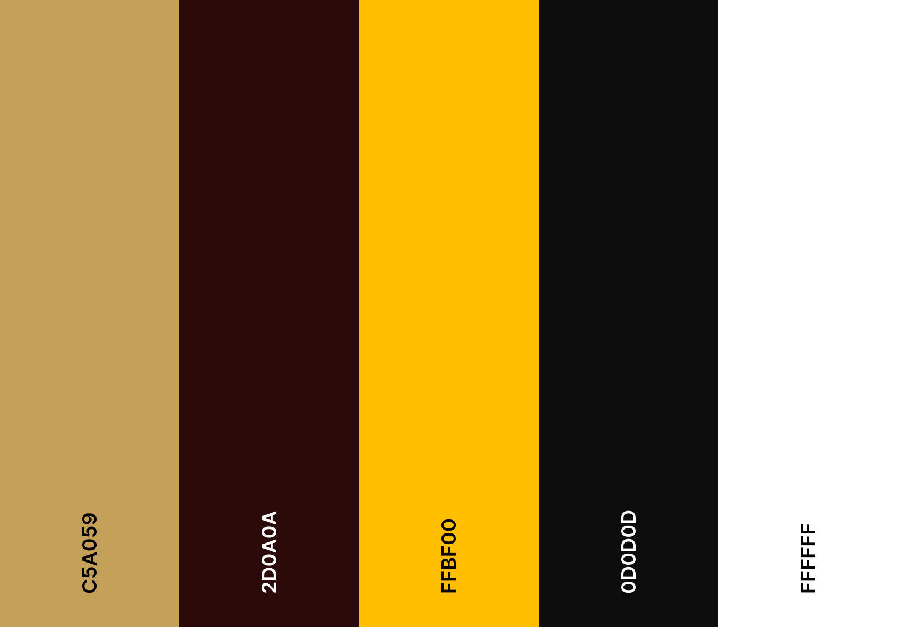

Tipografía

La tipografía seleccionada busca combinar elegancia clásica con claridad moderna.

Tipografía de títulos:
 - Playfair Display
 - Utilizada en encabezados principales, landing page y textos hero.
 - Refuerza el carácter sofisticado y exclusivo de la marca.

Tipografía de contenido:
 - Inter
 - Utilizada en dashboards, formularios y contenido funcional.
 - Favorece la legibilidad y la claridad visual.

Tipografía complementaria:
 - Geist
 - Utilizada en labels, botones y componentes secundarios.

Iconografía

La iconografía mantiene un estilo minimalista y moderno:
 - Líneas simples.
 - Bordes suaves.
 - Uso de iconos outline.
 - Indicadores visuales elegantes.
 - Coherencia con dashboards analíticos modernos.

### 6.1.2. Web Style Guidelines.

**Imágenes**

Las imágenes utilizadas en VineVault tienen una finalidad principalmente emocional y contextual:
 - Fotografías de cavas premium.
 - Botellas de vino de alta gama.
 - Ambientes elegantes y cálidos.
 - Fondos oscuros con iluminación cinematográfica.

Las imágenes se utilizan principalmente en:
 - Landing page.
 - Secciones hero.
 - Tarjetas destacadas.
 - Vistas de detalle de botella.

Todas las imágenes están optimizadas para pantallas de alta resolución.

Botones

Los botones utilizan esquinas redondeadas y alto contraste visual.

Tipos de botones:
 - Primary Button: Utilizado para acciones principales:
   - Guardar.
   - Registrar.
   - Confirmar.
   - Continuar.
 - Secondary Button: Fondo oscuro con borde iluminado, utilizado para acciones secundarias.
 - Outlined Button: Botón transparente con borde dorado.

Pantallas Emergentes

Los modales utilizan:
 - Fondo oscurecido.
 - Contenedores centrales con glow sutil.
 - Indicadores visuales claros.
 - Confirmaciones destacadas en color dorado.

Diseño Responsive

La plataforma fue diseñada bajo un enfoque responsive:
 - Adaptación para desktop y tablets.
 - Sidebar colapsable.
 - Navegación vertical simplificada en pantallas pequeñas.
 - Componentes reorganizados dinámicamente.

## 6.2. Information Architecture.
La arquitectura de información de VineVault se ha diseñado para que el usuario pueda gestionar, monitorear y analizar colecciones de vinos y destilados de manera rápida e intuitiva, priorizando la claridad visual y la reducción de fricción cognitiva dentro de la plataforma.
El flujo principal del sistema se centra en acciones esenciales como registrar botellas, supervisar el estado ambiental de las cavas inteligentes y visualizar analíticas relacionadas con el inventario y la conservación de las colecciones.

### 6.2.1. Labeling Systems.

**Sistemas de Organización Visual:**

Se aplicará una organización jerárquica y modular, permitiendo que el usuario navegue de manera progresiva entre las distintas funcionalidades del sistema:

-  Registrar nuevas botellas o crear una nueva cava inteligente.  
-  Gestionar inventario y visualizar el estado de las colecciones almacenadas.  
-  Monitorear temperatura, humedad y sensores IoT en tiempo real.  
-  Analizar reportes y gráficos históricos relacionados con la conservación de los vinos.  
-  Configurar preferencias, alertas y parámetros generales de la cuenta.  

**Esquemas de Categorización del Contenido:**

-  **Por función:** Panel Principal, Cavas Inteligentes, Inventario, Ambiente, Alertas, Analíticas y Configuración.  
-  **Por tipo de interacción:** Registro, Monitoreo, Visualización, Gestión, Configuración y Exportación de datos.  

Esto permitirá que el usuario identifique rápidamente cada módulo de la plataforma, facilitando la navegación entre las distintas pantallas sin sobrecargar visualmente la interfaz del sistema.

### 6.2.2. Searching Systems.

En la Landing Page, se utilizarán etiquetas simples e intuitivas que permitan al visitante navegar fácilmente entre las distintas secciones informativas de VineVault:

-  **Inicio:** Presentación general de VineVault y su propuesta tecnológica.  
-  **Acerca de:** Información sobre la startup, misión y visión del sistema.  
-  **Servicios:** Descripción de las funcionalidades relacionadas con monitoreo IoT, gestión de inventario y control         ambiental.  
-  **Planes:** Visualización de planes de suscripción y beneficios disponibles.  
-  **Contacto:** Formulario de consultas, soporte y comunicación comercial.  
-  **Iniciar Sesión:** Acceso a la plataforma web para usuarios registrados.  

En la Aplicación Web, el sistema de búsqueda permitirá localizar rápidamente botellas, cavas inteligentes, códigos de inventario y registros ambientales mediante filtros y palabras clave. Asimismo, se podrán realizar búsquedas por nombre del vino, añada, zona de cava y estado de conservación, facilitando la administración eficiente de las colecciones almacenadas dentro del sistema.

### 6.2.3. SEO Tags and Meta Tags.

Para optimizar la visibilidad de VineVault en motores de búsqueda web, se implementarán las siguientes etiquetas:

- **Title:** VineVault  

- **Meta Tags:**  
  - **Description:** Plataforma inteligente para la gestión de cavas y monitoreo ambiental de colecciones de vinos mediante sensores IoT, analíticas y control en tiempo real.  

  - **Keywords:** cavas inteligentes, monitoreo de vinos, gestión de inventario, sensores IoT, conservación de vinos, analíticas de cava, control ambiental, wine cellar management.  

  - **Author:** VineVault Viticulture Systems.

### 6.2.4. Navigation Systems.

**Landing Page**

- **Inicio:** Presentación general de VineVault y acceso directo a las funcionalidades principales del sistema.  
- **Acerca de:** Información sobre la startup, misión y visión orientadas a la gestión inteligente de cavas.  
- **Servicios:** Sección informativa sobre monitoreo IoT, control ambiental, inventario inteligente y analíticas de conservación.  
- **Planes:** Comparativa de planes y suscripciones disponibles para los usuarios.  
- **Contacto:** Formulario de consultas y medios de soporte.  
- **Iniciar Sesión:** Botón de acción principal (CTA) que redirige hacia la aplicación web.  

**Web Application**

- **Panel Principal:** Vista general con métricas de inventario, estado ambiental y actividad reciente.  
- **Cavas Inteligentes:** Administración de cavas registradas, zonas y condiciones de almacenamiento.  
- **Inventario:** Gestión y visualización de botellas, códigos, añadas y estados de conservación.  
- **Ambiente:** Monitoreo en tiempo real de temperatura, humedad y sensores IoT.  
- **Alertas:** Visualización de notificaciones relacionadas con cambios ambientales o riesgos de conservación.  
- **Analíticas:** Reportes gráficos y estadísticas relacionadas con el rendimiento y estado de las colecciones.  
- **Configuración:** Gestión de perfil, preferencias, calibración de sensores y parámetros generales del sistema.  

**Mobile Application**

- **Barra inferior:** Accesos rápidos a Inicio, Inventario, Ambiente, Alertas y Perfil.  
- **Notificaciones en tiempo real:** Alertas relacionadas con cambios de temperatura, humedad o riesgos de conservación.  
- **Navegación simplificada:** Interfaz coherente con el entorno web, manteniendo la misma identidad visual y organización modular de la plataforma.

## 6.3. Landing Page UI Design.

### 6.3.1 Landing Page Wireframe.

El wireframe de la landing page de VineVault representa la estructura esquemática de baja fidelidad, priorizando la jerarquía de información y los puntos de interacción clave para maximizar la conversión. Orientado a coleccionistas particulares y empresas.

**Estructura por bloques (de arriba abajo):**

1. **Hero**
   - Logotipo + menú principal (Funcionalidades, Planes, Contacto)
   - Título principal + texto de valor (placeholder)
   - CTA primario: "Probar VineVault"   

2. **Impacto de conservación**
   - Subtítulo explicativo
   - Indicadores 

3. **Funcionalidades principales**
   - Grid de 3 columnas
   - Cada celda: `[icono]` + título + línea de descripción   

4. **Planes de suscripción**
   - Tarjetas: Básico / Premiun
   - Cada tarjeta: nombre, precio, caulidades, CTA "Seleccionar"
   - Plan recomendado destacado visualmente

5. **Formulario de contacto**
   - Campos: nombre, email, mensaje
   - Botón de envío
   - Texto de privacidad breve

6. **Footer institucional**      
   - Copyright

 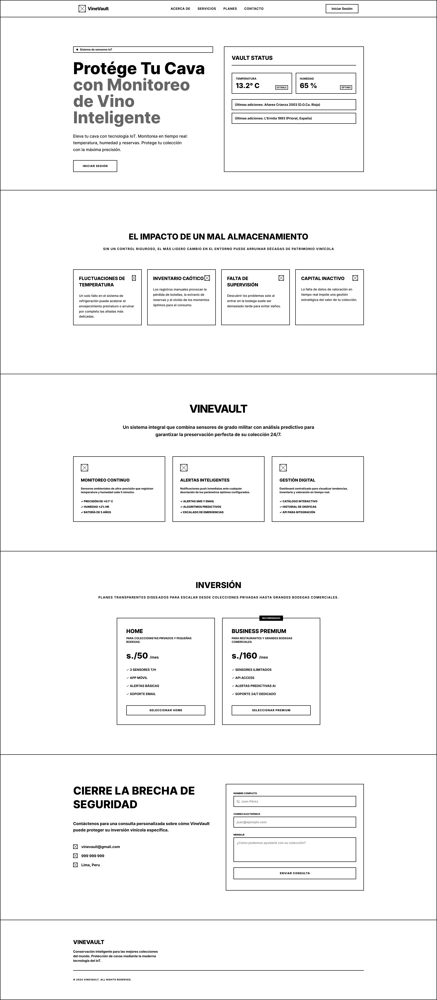

### 6.3.2 Landing Page Mock-up.

La landing page de VineVault se diseñó como un punto de conversión estratégico, orientado a proyectar valores de exclusividad e innovación, así como a garantizar una protección eficiente tanto para coleccionistas particulares como para empresas. 

La estructura principal se compone de:
- Hero.
- Impacto de conservación.
- Funcionalidades principales.
- Planes de suscripción.
- Formulario de contacto.
- Footer institucional.

 

## 6.4. Applications UX/UI Design.

Esta sección está dedicada al diseño de la experiencia de usuario (UX) y la interfaz de usuario (UI) de las aplicaciones que conforman la solución. El objetivo es crear interfaces funcionales, accesibles y visualmente coherentes que respondan a las necesidades y expectativas de los usuarios finales.

### 6.4.1. Applications Wireframes.

En esta sección se presentan los wireframes de las aplicaciones, que muestran el diseño estructural y la disposición de los elementos clave para la experiencia de usuario.

Web Application

**Login**

 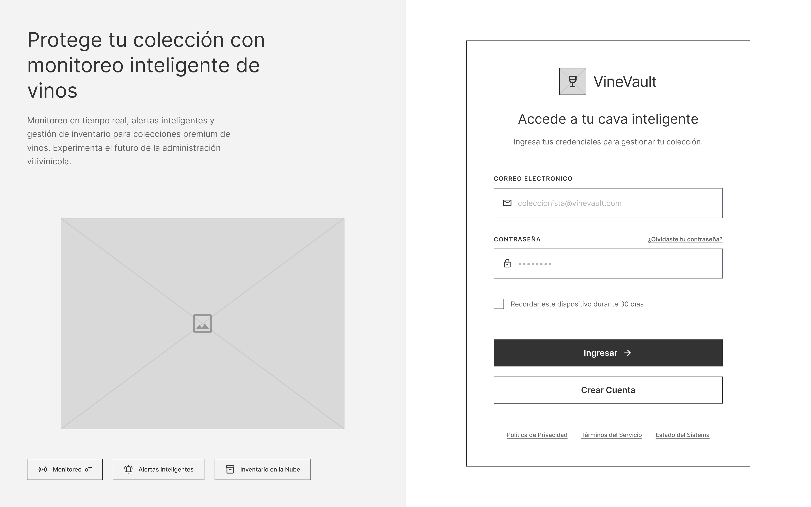

La interfaz de autenticación presenta un diseño centralizado y minimalista que prioriza la claridad funcional. El wireframe utiliza un contenedor de bordes definidos sobre un fondo neutro, integrando campos de entrada directos para credenciales y un botón de acción de alto contraste, lo que refuerza una estética tecnológica y ordenada coherente con el ecosistema de Vinevault.

**Register**

 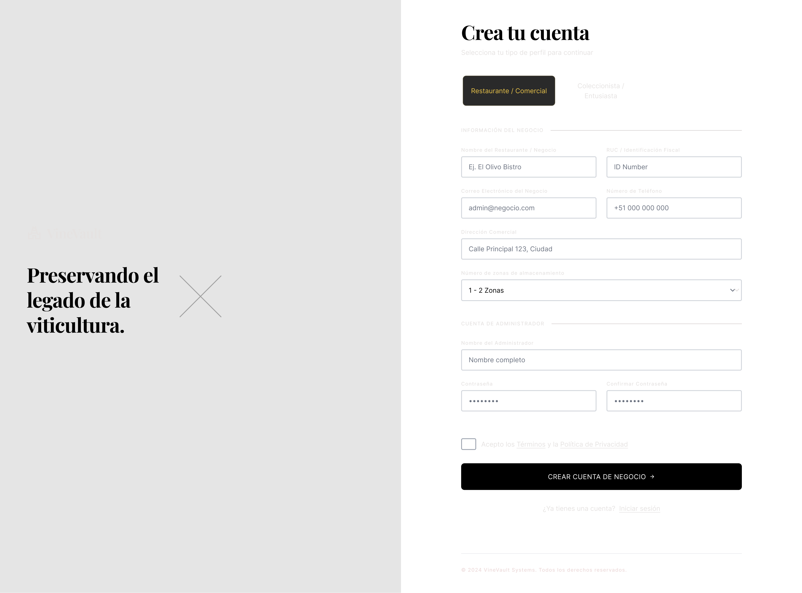

El diseño de registro mantiene la coherencia visual mediante una estructura vertical limpia que facilita el flujo de usuario. Este wireframe integra campos de entrada estándar, un selector para términos legales, logrando un equilibrio entre simplicidad y funcionalidad bajo una estética técnica y minimalista.

**Inventory**

 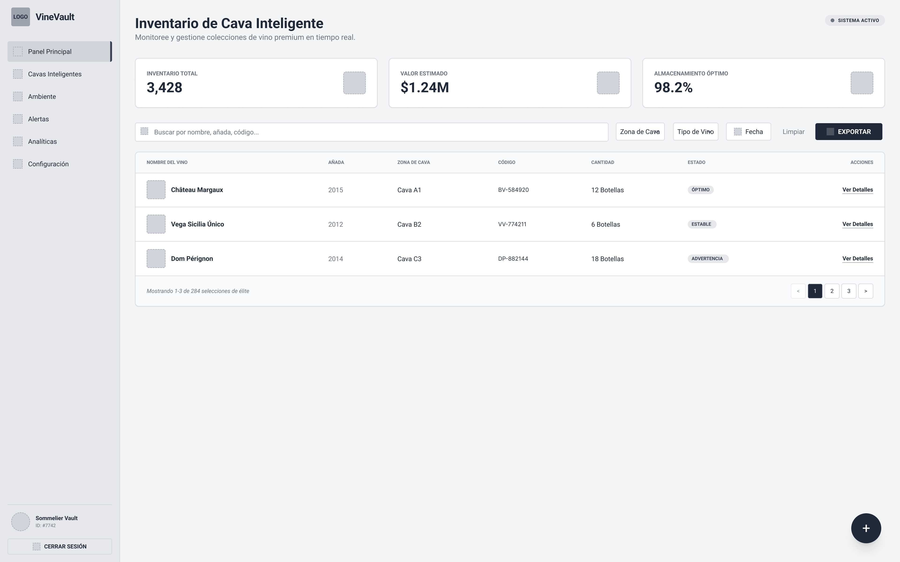

El diseño de inventario (Inventory) presenta una interfaz de gestión de datos estructurada en dos niveles: un panel superior de indicadores clave (KPI) y una tabla de listado dinámico. Este wireframe prioriza la eficiencia operativa mediante filtros combinados, columnas ordenables y acciones directas por fila. La organización por zonas de cava, tipo de vino y rastreo por código refuerza el control total sobre colecciones de vino premium, manteniendo una estética funcional y orientada a datos en tiempo real.

**Cava Inteligente**

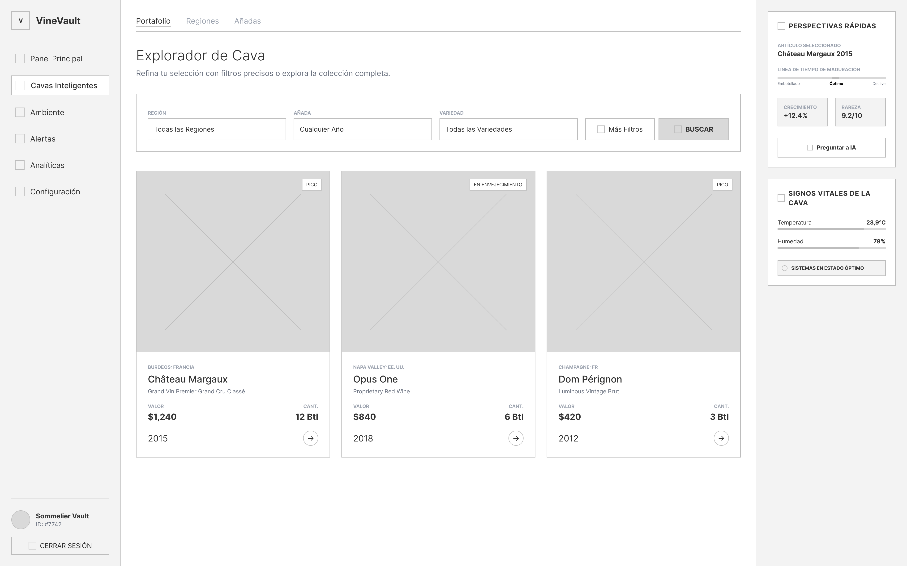

El diseño de Cava Inteligente presenta una interfaz de exploración y análisis detallado, estructurada en un panel de navegación principal, un explorador de colección con filtros avanzados y un área de visualización lateral para ítems seleccionados. Este wireframe integra una línea de tiempo de maduración, indicadores de valor y rareza (con asistencia de IA), así como sensores ambientales en tiempo real (temperatura, humedad). La disposición combina la exploración por regiones, añadas y variedades con una vitrina de recomendaciones por denominación de origen, logrando un equilibrio entre descubrimiento y control técnico del cava.

**Ambiente**

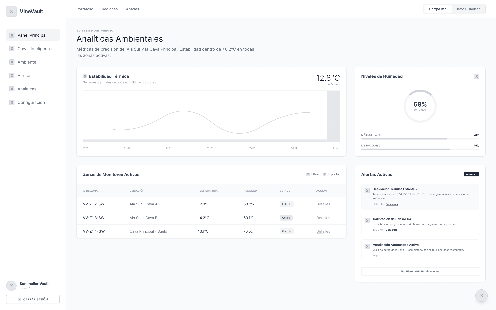

El diseño de Ambiente presenta una interfaz de monitoreo ambiental en tiempo real, estructurada en un panel de métricas de precisión, gráfico de estabilidad térmica, tabla de zonas activas, indicadores de humedad y un listado de alertas operativas. Este wireframe integra sensores de temperatura y humedad por zona, umbrales críticos, y acciones de reconocimiento/descartes sobre incidencias. La disposición permite supervisar ciclos de enfriamiento, ventilación automática y calibración de sensores, priorizando el control climatológico de cavas inteligentes bajo una estética técnica y orientada a la prevención.

**Analítica**

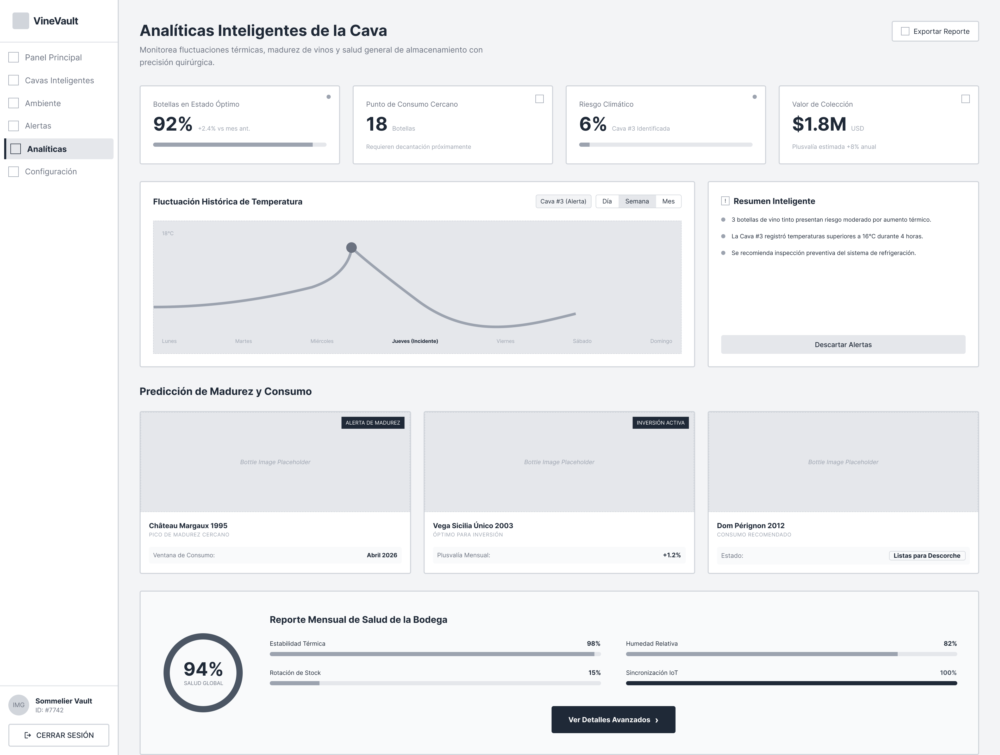

El diseño de Analítica presenta una interfaz de inteligencia de datos para la supervisión predictiva de la cava, estructurada en un panel de indicadores clave (KPI), gráfico de fluctuación térmica histórica, resumen inteligente con recomendaciones automáticas, bloque de predicción de madurez y consumo, y un reporte mensual de salud de bodega. Este wireframe integra alertas predictivas por riesgo climático, plusvalía estimada de colecciones, ventanas de consumo óptimo y métricas IoT (estabilidad térmica, rotación de stock, humedad relativa, sincronización). La disposición prioriza la anticipación a incidentes y la toma de decisiones basada en datos bajo una estética técnica y analítica.

### 6.4.2. Applications Wireflow Diagrams.

**Wireflow 1: Onboarding y Gestión de Colección**

Flujo: Registro → Landing → Inventario

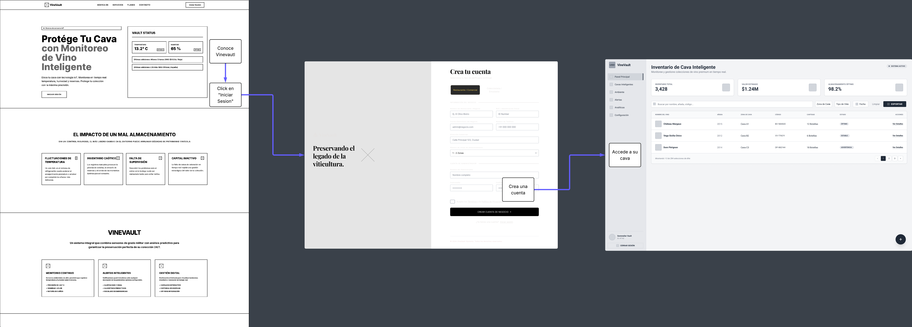

Recorrido típico:

1. Conoce la propuesta en Landing Page
2. Usuario se registra en Register
3. Accede a su colección en Inventory

**Wireflow 2: Monitoreo y Control de Cava**

Flujo: Inventario → Cava Inteligente → Ambiente → Analítica

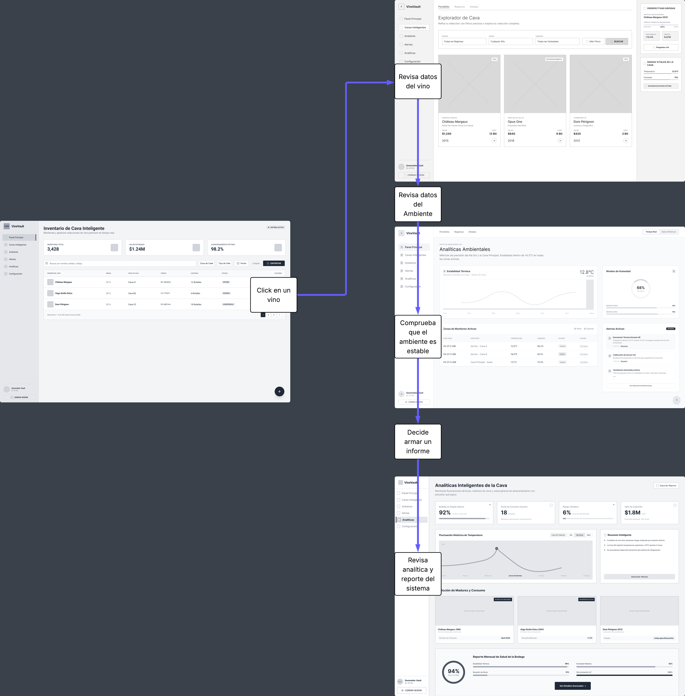

Recorrido típico:

1. Desde el listado de Inventory, selecciona un vino
2. Explora detalles y maduración en Cava Inteligente
3. Revisa condiciones ambientales en Ambiente
4. Analiza tendencias y reportes en Analítica

### 6.4.3. Applications Mock-ups.

Esta sección presenta los mock-ups de las aplicaciones, los cuales detallan el acabado visual, la paleta de colores y la disposición definitiva de los elementos que componen la experiencia de usuario.

**Login**

 

La interfaz de autenticación presenta un diseño elegante y sofisticado que refleja la exclusividad del servicio. El mock-up destaca por su paleta cromática oscura y minimalista, que organiza los campos de credenciales y los elementos de navegación de forma jerárquica y clara, garantizando una experiencia de usuario intuitiva y visualmente coherente con la identidad premium de VineVault.

**Register**

 

La interfaz de registro adopta un enfoque estructurado y profesional, diseñado para facilitar la captura de datos complejos mediante una organización lógica de formularios. El mock-up utiliza una disposición limpia y segmentada que diferencia claramente la información corporativa de las credenciales de acceso, manteniendo la sobriedad visual y la elegancia que caracterizan a VineVault, lo que asegura una experiencia de alta gama para el usuario desde el primer contacto.

**Inventory**

 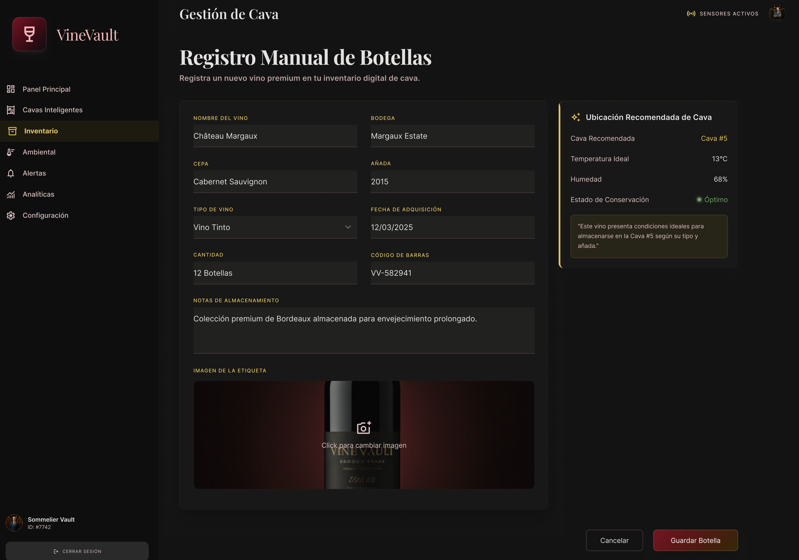

La interfaz de gestión de inventario de VineVault está diseñada para ofrecer un control preciso y profesional, integrando campos de datos detallados con una función inteligente de recomendación de ubicación basada en parámetros de conservación óptimos. Su mock-up combina una estructura funcional y limpia, que permite registrar lotes de vinos de alta gama de manera ágil, manteniendo la identidad visual sobria y tecnológica del ecosistema para garantizar una administración técnica impecable de la cava.

**Cava Inteligente**

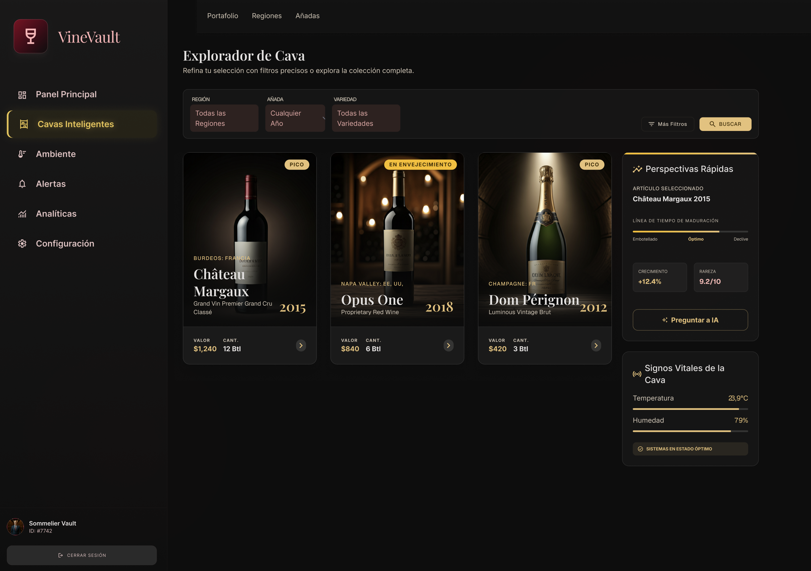

La sección de "Cavas Inteligentes" se presenta como un explorador de alta precisión, donde el mock-up organiza la colección mediante una interfaz de tarjetas visualmente atractivas y filtros avanzados de búsqueda. Este diseño no solo facilita la gestión técnica del inventario, sino que integra de forma elegante paneles laterales de "Perspectivas Rápidas" y monitoreo en tiempo real, consolidando una herramienta potente y sofisticada que permite al usuario supervisar tanto el estado de conservación como el valor estratégico de sus etiquetas premium con total claridad.

**Ambiente**

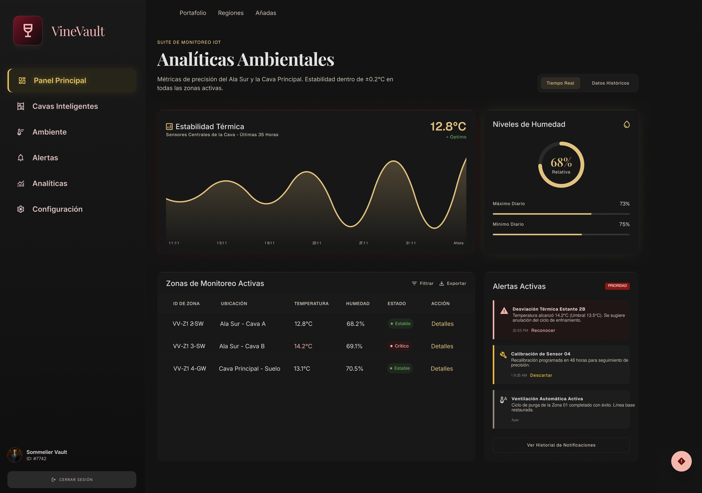

La interfaz de Ambiente actúa como un centro neurálgico de alta precisión, donde el mock-up prioriza la visualización de datos críticos mediante gráficos dinámicos de estabilidad térmica y niveles de humedad en tiempo real. Esta estructura se complementa con tablas detalladas de zonas activas y un panel de alertas inmediatas, logrando una arquitectura de información intuitiva que permite al usuario supervisar y gestionar proactivamente las condiciones climáticas del entorno vitivinícola con una claridad técnica absoluta.

**Analítica**

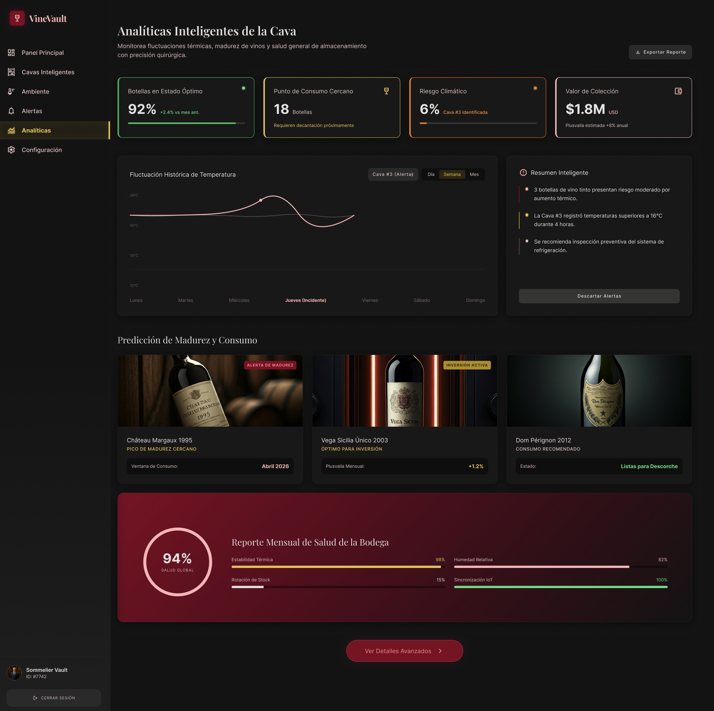

La pantalla de Analíticas funciona como un panel de control ejecutivo de alto nivel, donde el mock-up despliega información estratégica mediante indicadores clave de rendimiento (KPIs), proyecciones de madurez de las etiquetas y un reporte de salud global de la bodega. Esta disposición permite al usuario visualizar tendencias, riesgos climáticos y oportunidades de inversión de manera unificada, combinando gráficos de datos históricos con resúmenes inteligentes que facilitan una toma de decisiones informada y profesional sobre su colección premium.

### 6.4.4. Applications User Flow Diagrams.

## 6.5. Applications Prototyping.

En esta sección se presentan los prototipos interactivos de las aplicaciones, que permiten visualizar y probar la experiencia de usuario antes del desarrollo final.

**Web Application Prototype**

El prototipo de la aplicación web muestra la estructura general de navegación, el diseño de las principales vistas y las funcionalidades clave que tendrá la plataforma. Permite simular el flujo de navegación de los usuarios y visualizar cómo interactúan con los distintos módulos del sistema.

 

Web Application Prototype: https://sl1nk.com/v7zy0bh