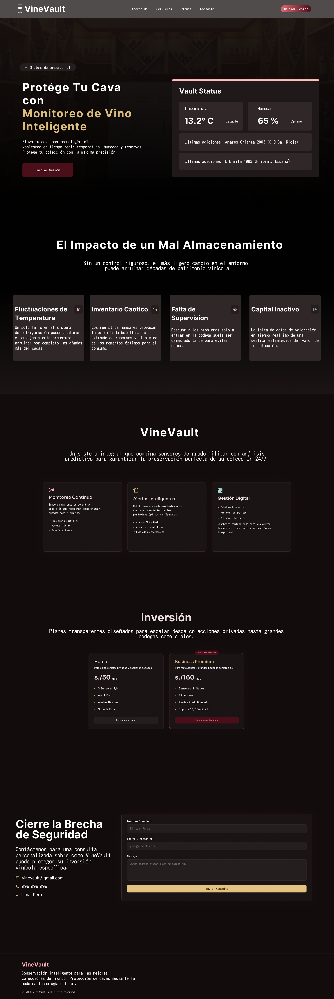

# Capítulo VI: Solution UX Design.

## 6.1. Style Guidelines.
### 6.1.1. General Style Guidelines.
### Branding

#### Branch Overview

VineVault es una solución tecnológica diseñada para la gestión inteligente de cavas y colecciones de vino, enfocada tanto para coleccionistas privados como para restaurantes y negocios especializados. La plataforma implementa monitoreo ambiental a través de sensores IoT, analítica de conservación e inventario digital en una experiencia moderna y sofisticada.

La identidad visual de VineVault busca transmitir:

 - Exclusividad y elegancia.
 - Seguridad y preservación.
 - Tecnología avanzada aplicada a la viticultura.
 - Experiencia premium enfocada en vinos de todas gamas.

El diseño de la plataforma toma inspiración en interfaces fintech modernas y dashboards analíticos de alto nivel, incorporando una estética minimalista que refuerza la percepción de calidad y confiabilidad.

#### Brand Name

El nombre VineVault nace de la unión de dos conceptos principales:
 - Vine: Hace referencia directa al mundo del vino, la viticultura y las colecciones premium.
 - Vault: Representa una bóveda, enfatizando la protección y conservación de botellas valiosas.

El nombre refleja la esencia del proyecto: una bóveda inteligente para la preservación y administración de vinos.

#### Colores

La identidad visual de VineVault utiliza una paleta de colores oscuros y elegantes inspirados en cavas y vinos de alta gama.

 - Color Primario - #C5A059  
Utilizado para botones principales, indicadores destacados y elementos interactivos prioritarios. Representa lujo, exclusividad y sofisticación.
 - Color Secundario - #2D0A0A  
Color vino oscuro utilizado en fondos degradados, tarjetas y acentos visuales relacionados con la marca.
 - Color Terceario - #FFBF00  
Utilizado para alertas suaves, indicadores analíticos y elementos destacados secundarios.
 - Neutral - #0D0D0D y #FFFFFF  
Color base principal de la interfaz utilizado en fondos, sidebars, contenedores generales y letras.

La combinación de colores neutros profundo, tonos vino y detalles dorados crea una atmósfera premium alineada con el concepto de conservación de vinos de lujo.

 

#### Tipografía

La tipografía seleccionada busca combinar elegancia clásica con claridad moderna.

Tipografía de títulos:
 - Playfair Display
 - Utilizada en encabezados principales, landing page y textos hero.
 - Refuerza el carácter sofisticado y exclusivo de la marca.

Tipografía de contenido:
 - Inter
 - Utilizada en dashboards, formularios y contenido funcional.
 - Favorece la legibilidad y la claridad visual.

Tipografía complementaria:
 - Geist
 - Utilizada en labels, botones y componentes secundarios.

#### Iconografía

La iconografía mantiene un estilo minimalista y moderno:
 - Líneas simples.
 - Bordes suaves.
 - Uso de iconos outline.
 - Indicadores visuales elegantes.
 - Coherencia con dashboards analíticos modernos.

### 6.1.2. Web Style Guidelines.

#### Imágenes

Las imágenes utilizadas en VineVault tienen una finalidad principalmente emocional y contextual:
 - Fotografías de cavas premium.
 - Botellas de vino de alta gama.
 - Ambientes elegantes y cálidos.
 - Fondos oscuros con iluminación cinematográfica.

Las imágenes se utilizan principalmente en:
 - Landing page.
 - Secciones hero.
 - Tarjetas destacadas.
 - Vistas de detalle de botella.

Todas las imágenes están optimizadas para pantallas de alta resolución.

#### Botones

Los botones utilizan esquinas redondeadas y alto contraste visual.

Tipos de botones:
 - Primary Button: Utilizado para acciones principales:
   - Guardar.
   - Registrar.
   - Confirmar.
   - Continuar.
 - Secondary Button: Fondo oscuro con borde iluminado, utilizado para acciones secundarias.
 - Outlined Button: Botón transparente con borde dorado.

#### Pantallas Emergentes

Los modales utilizan:
 - Fondo oscurecido.
 - Contenedores centrales con glow sutil.
 - Indicadores visuales claros.
 - Confirmaciones destacadas en color dorado.

#### Diseño Responsive

La plataforma fue diseñada bajo un enfoque responsive:
 - Adaptación para desktop y tablets.
 - Sidebar colapsable.
 - Navegación vertical simplificada en pantallas pequeñas.
 - Componentes reorganizados dinámicamente.

## 6.2. Information Architecture.
La arquitectura de información de VineVault se ha diseñado para que el usuario pueda gestionar, monitorear y analizar colecciones de vinos y destilados de manera rápida e intuitiva, priorizando la claridad visual y la reducción de fricción cognitiva dentro de la plataforma.
El flujo principal del sistema se centra en acciones esenciales como registrar botellas, supervisar el estado ambiental de las cavas inteligentes y visualizar analíticas relacionadas con el inventario y la conservación de las colecciones.

### 6.2.1. Web Style Guidelines.

#### Sistemas de Organización Visual:  
Se aplicará una organización jerárquica y modular, permitiendo que el usuario navegue de manera progresiva entre las distintas funcionalidades del sistema:

-  Registrar nuevas botellas o crear una nueva cava inteligente.  
-  Gestionar inventario y visualizar el estado de las colecciones almacenadas.  
-  Monitorear temperatura, humedad y sensores IoT en tiempo real.  
-  Analizar reportes y gráficos históricos relacionados con la conservación de los vinos.  
-  Configurar preferencias, alertas y parámetros generales de la cuenta.  

#### Esquemas de Categorización del Contenido:  
-  **Por función:** Panel Principal, Cavas Inteligentes, Inventario, Ambiente, Alertas, Analíticas y Configuración.  
-  **Por tipo de interacción:** Registro, Monitoreo, Visualización, Gestión, Configuración y Exportación de datos.  

Esto permitirá que el usuario identifique rápidamente cada módulo de la plataforma, facilitando la navegación entre las distintas pantallas sin sobrecargar visualmente la interfaz del sistema.

### 6.2.2. Searching Systems.

En la Landing Page, se utilizarán etiquetas simples e intuitivas que permitan al visitante navegar fácilmente entre las distintas secciones informativas de VineVault:

-  **Inicio:** Presentación general de VineVault y su propuesta tecnológica.  
-  **Acerca de:** Información sobre la startup, misión y visión del sistema.  
-  **Servicios:** Descripción de las funcionalidades relacionadas con monitoreo IoT, gestión de inventario y control         ambiental.  
-  **Planes:** Visualización de planes de suscripción y beneficios disponibles.  
-  **Contacto:** Formulario de consultas, soporte y comunicación comercial.  
-  **Iniciar Sesión:** Acceso a la plataforma web para usuarios registrados.  

En la Aplicación Web, el sistema de búsqueda permitirá localizar rápidamente botellas, cavas inteligentes, códigos de inventario y registros ambientales mediante filtros y palabras clave. Asimismo, se podrán realizar búsquedas por nombre del vino, añada, zona de cava y estado de conservación, facilitando la administración eficiente de las colecciones almacenadas dentro del sistema.

### 6.2.3. SEO Tags and Meta Tags.

Para optimizar la visibilidad de VineVault en motores de búsqueda web, se implementarán las siguientes etiquetas:

- **Title:** VineVault  

- **Meta Tags:**  
  - **Description:** Plataforma inteligente para la gestión de cavas y monitoreo ambiental de colecciones de vinos mediante sensores IoT, analíticas y control en tiempo real.  

  - **Keywords:** cavas inteligentes, monitoreo de vinos, gestión de inventario, sensores IoT, conservación de vinos, analíticas de cava, control ambiental, wine cellar management.  

  - **Author:** VineVault Viticulture Systems.

### 6.2.4. Navigation Systems.

### Landing Page

- **Inicio:** Presentación general de VineVault y acceso directo a las funcionalidades principales del sistema.  
- **Acerca de:** Información sobre la startup, misión y visión orientadas a la gestión inteligente de cavas.  
- **Servicios:** Sección informativa sobre monitoreo IoT, control ambiental, inventario inteligente y analíticas de conservación.  
- **Planes:** Comparativa de planes y suscripciones disponibles para los usuarios.  
- **Contacto:** Formulario de consultas y medios de soporte.  
- **Iniciar Sesión:** Botón de acción principal (CTA) que redirige hacia la aplicación web.  

### Web Application

- **Panel Principal:** Vista general con métricas de inventario, estado ambiental y actividad reciente.  
- **Cavas Inteligentes:** Administración de cavas registradas, zonas y condiciones de almacenamiento.  
- **Inventario:** Gestión y visualización de botellas, códigos, añadas y estados de conservación.  
- **Ambiente:** Monitoreo en tiempo real de temperatura, humedad y sensores IoT.  
- **Alertas:** Visualización de notificaciones relacionadas con cambios ambientales o riesgos de conservación.  
- **Analíticas:** Reportes gráficos y estadísticas relacionadas con el rendimiento y estado de las colecciones.  
- **Configuración:** Gestión de perfil, preferencias, calibración de sensores y parámetros generales del sistema.  

### Mobile Application

- **Barra inferior:** Accesos rápidos a Inicio, Inventario, Ambiente, Alertas y Perfil.  
- **Notificaciones en tiempo real:** Alertas relacionadas con cambios de temperatura, humedad o riesgos de conservación.  
- **Navegación simplificada:** Interfaz coherente con el entorno web, manteniendo la misma identidad visual y organización modular de la plataforma.

## 6.3. Landing Page UI Design.
La landing page de VineVault se diseñó como un punto de conversión estratégico, orientado a proyectar valores de exclusividad e innovación, así como a garantizar una protección eficiente tanto para coleccionistas particulares como para empresas. 

La estructura principal se compone de:
- Hero.
- Impacto de conservación.
- Funcionalidades principales.
- Planes de suscripción.
- Formulario de contacto.
- Footer institucional.

 

## 6.4. Applications UX/UI Design.

## 6.5. Applications Prototyping.
